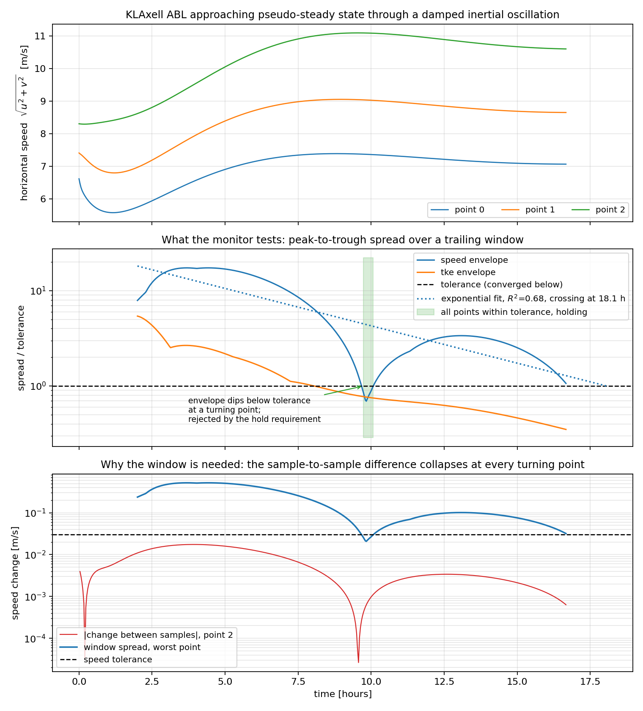

# Pseudo-steady RANS convergence monitor: design note

Goal: let a KLAxell RANS run decide for itself when it has reached a pseudo-steady state,
write a checkpoint and a plotfile, and exit cleanly — instead of the user guessing a
`time.stop_time` and either wasting core-hours or stopping short.

The user supplies a list of monitor points. At those points the code tracks horizontal wind
speed and TKE; when every point has been quiet for long enough, the run stops.

Scope: **KLAxell only**. This is a deliberate restriction, not an accident of implementation
— see Section 1.

Code files:

- `src/utilities/output_quantities/RANSConvergence.{H,cpp}` (the monitor)
- `src/core/SimTime.{H,cpp}` (`request_stop()`, checked in `continue_simulation()`)
- `src/incflo.cpp` (forced final output on a convergence stop)
- `unit_tests/utilities/test_rans_convergence.cpp` (envelope fit and tolerance rule)
- `test/test_files/abl_rans_convergence/` (regression test)
- User documentation: `docs/sphinx/user/inputs_RANSConvergence.rst`
- Reused as-is: `src/utilities/sampling/ProbeSampler.cpp`,
  `src/utilities/sampling/SamplingContainer.H`, `src/utilities/PostProcessing.H`

---

## 1. Why KLAxell only

The criterion is a drift test on an instantaneous point value. That is only meaningful if the
quantity being tested actually approaches a limit.

In an LES the velocity at a probe is turbulent forever. It has no limit, only a statistic, so a
drift test on the raw value never passes and a drift test on a running mean passes trivially
(a cumulative mean converges like `1/N` whether or not the flow is stationary). Making the
criterion honest under LES requires block-mean-versus-block-mean comparisons, a defensible
averaging window, and an argument about the integral time scale. None of that is needed for a
RANS run marching to a steady state, and shipping the LES machinery "just in case" would
invite users to apply a criterion that cannot support the conclusion they draw from it.

So the monitor aborts at construction if the turbulence model is not KLAxell. The idiom already
exists in the TKE source term — `src/equation_systems/tke/source_terms/KransAxell.cpp:28`:

    AMREX_ALWAYS_ASSERT(sim.turbulence_model().model_name() == "KLAxell");

The monitor should use `amrex::Abort` with a message naming the model actually in use, rather
than a bare assert, since this is user input error and not a programming invariant.
`model_name()` is declared in `src/turbulence/TurbulenceModel.H:71` and returns `"KLAxell"`
from `src/turbulence/RANS/KLAxell.H:33`.

Two consequences of the restriction, both simplifying:

- The `tke` field is guaranteed to exist. KLAxell requires the TKE transport equation, so none
  of the LES-side fallbacks (resolved TKE from `ReynoldsStress`, graceful degradation under
  Smagorinsky, which carries no `tke` field at all) are needed.
- No time averaging anywhere in the monitor. The instantaneous interpolated value is the
  quantity of interest. A time mean would only lag the signal and delay the stop.

---

## 2. What is monitored

Per point, two scalars:

    S = sqrt(u^2 + v^2)          horizontal wind speed
    k = tke

**Horizontal speed only — `w` is excluded.** In a converging ABL the vertical component is
small and comparatively noisy; folding it into the magnitude adds jitter to the convergence
envelope (Section 3) and delays the stop without making the test more informative. The
horizontal components are also what the downstream consumer of these runs cares about.

TKE is included as requested. Note that it is generally the slower of the two to settle: the
momentum field can look steady while the turbulence field is still adjusting, particularly near
the boundary-layer top where `turb_lscale` is still growing.

Wind *direction* is a candidate third criterion and is discussed in Section 3.3, but is not
part of the initial design.

---

## 3. The convergence criterion

### 3.1 Why the obvious test fails

The natural first attempt is an endpoint difference:

    |phi(t) - phi(t - Delta)| < tol

This is wrong for an ABL RANS run with Coriolis and geostrophic forcing, and the reason is
physical rather than numerical.

A neutral ABL under geostrophic forcing does not decay monotonically to steady state. It
spirals in via a damped inertial oscillation of period `T_i = 2*pi/f`, with
`f = 2*Omega*sin(phi)` (`src/equation_systems/icns/source_terms/CoriolisForcing.cpp:46`).
For the shipped `abl_wallrans_neutral` case — `CoriolisForcing.latitude = 90`,
`rotational_time_period = 125663.706143592` — this gives

    Omega = 2*pi / 125663.706 = 5.0e-5 rad/s
    f     = 2 * Omega * sin(90 deg) = 1.0e-4 1/s
    T_i   = 2*pi / f = 62832 s = 17.45 h

The endpoint difference goes to zero at **every turning point of that oscillation**. A monitor
using it will declare convergence at the first peak, potentially many hours of physical time
before the oscillation amplitude has actually decayed. The failure is silent and produces a
plausible-looking checkpoint of an unconverged field.

### 3.2 Envelope test

Instead, buffer the last `N` samples of each monitored scalar over a trailing window of
physical duration `W`, and require the peak-to-trough spread across the window to be small:

    max_{t in [T-W, T]} phi(t)  -  min_{t in [T-W, T]} phi(t)  <  tol

A turning point does not satisfy this, because the window still contains the swing on both
sides of the extremum. The test only passes when the signal is genuinely flat over `W`.

Cost is one small ring buffer per (point, scalar). With `W = 3600 s` and a sample every
`60 s` that is 60 entries per scalar — negligible.

`W` should be a meaningful fraction of the inertial period. The sample interval should be
generous for the same reason — sampling every step buys no information (the field cannot move
meaningfully in one `dt`) and only inflates the buffer.

### 3.3 The window shrinks the turning-point dip but does not remove it

This was found by running the monitor, not by reasoning about it beforehand, and it changed the
design.

Near a turning point the signal is locally quadratic, `S ~ S_0 + (1/2) S'' (t - t_0)^2`, so the
spread over a window is `~ (1/8) |S''| W^2` there, against `~ |S'| W` away from it. The ratio
is `O(W / T_i)`. A one-hour window against a 17.5 hour inertial period therefore still admits a
dip of more than an order of magnitude.

Measured on a coarse KLAxell case with `W = 3600 s` and `T_i = 62832 s`: the speed envelope rose
to 0.52 m/s, dipped to **0.022 m/s** at a turning point near `t = 35500 s`, then rose again to
0.099 m/s. The predicted ratio `W/(8 * T_i/2pi)` is about 4.5 %; the observed ratio is 4.2 %.

So a tolerance anywhere between 0.022 and 0.5 m/s would have stopped that run at a turning
point, with the flow still far from steady — the exact failure the window was introduced to
prevent, merely made twenty times less likely rather than impossible.

### 3.4 Persistence closes it

The dip is transient: it lasts on the order of one window (measured above, the envelope was
below 0.04 m/s for about 3500 s, against `W = 3600 s`). A sustained convergence is not.

So the criterion must hold *continuously* for `hold_time` before the run stops, defaulting to
`2 W`. A turning point cannot satisfy that at any window width or tolerance, which makes the
guard robust in a way that tuning `W` alone is not. The elapsed hold resets to zero the moment
any point falls back outside tolerance, and is written to the output file so that a run which
approached convergence and retreated is visible after the fact.

This is cheap — one timestamp — and it is the difference between a criterion that is usually
right and one that cannot be fooled by the oscillation it was designed around.

All quantities are in **physical time, not step count**. The RANS cases run with
`time.fixed_dt = -1` and CFL-based adaptive stepping, so a step-count window has no fixed
physical meaning.

### 3.5 Direction as a possible addition

The inertial oscillation shows up far more strongly in wind direction than in wind speed: the
hodograph rotates while `|U|` changes comparatively little. A speed-only criterion can
therefore pass while the flow is still turning. Adding

    max(theta) - min(theta) < tol_dir     (unwrapped, degrees)

over the same window would close that gap. Deferred for now, but the buffer structure should
not preclude it — store `u` and `v` in the buffer rather than only `S`, so direction can be
added later without changing the stored state.

---

## 4. Tolerance form

A single absolute tolerance does not work for TKE. It spans orders of magnitude between the
surface layer and the region above the boundary-layer top, so any absolute value is either
meaningless near the surface or unreachable aloft. A pure relative tolerance fails in the
opposite direction: as `k -> 0` above the BL, `rel_tol * k` becomes unsatisfiable noise.

Use the combined form for both scalars:

    spread < max(abs_tol, rel_tol * |phi_mean_over_window|)

This behaves as an absolute floor where the quantity is small and as a relative test where it
is large, and degrades gracefully at either end.

---

## 5. Per-point, never aggregated

The convergence test is applied **independently at every point, and all points must pass**.

Do not average the metric over the point cloud. A point drifting up and a point drifting down
cancel in the mean, and the aggregate passes while neither point has converged. This is not a
hypothetical: in an ABL with a rotating hodograph, points at different heights drift in
opposite directions by construction.

The corollary is that a trivially-converged point silently weakens the whole test, which is why
Section 7 rejects points inside terrain rather than filtering them quietly.

---

## 6. Sampling and interpolation

No new interpolation code. The existing sampling stack does exactly this:

- `ProbeSampler` (`src/utilities/sampling/ProbeSampler.cpp:16`) reads a point-cloud text file
  (first line: point count; then one `x y z` triple per line) and validates the points against
  the domain bounds.
- `SamplingContainer` (`src/utilities/sampling/SamplingContainer.H:96`) does trilinear
  interpolation of any field at those points, correctly across AMR levels, and handles
  redistribution after regrid.
- `Sampling::initialize()` (`src/utilities/sampling/Sampling.cpp:159-170`) shows the
  construction sequence: `setup_container`, `set_interpolation_order`, `initialize_particles`,
  `Redistribute`.

The monitor should **own** a `ProbeSampler` and a `SamplingContainer` directly rather than
deriving from `Sampling`. `Sampling` is registered via CRTP as a concrete factory entry and
carries the NetCDF/ASCII output paths, none of which the monitor needs.

Hook: `PostProcessBase::post_advance_work()` (`src/utilities/PostProcessing.H:48`), called
every step from `incflo::Evolve()`. The monitor gates internally on its own sample interval;
the base class already parses `output_interval` / `output_delay` / `output_start_time` via
`populate_output_parameters`, but a physical-time sample interval is wanted here (Section 3.2),
so the monitor parses its own.

`post_regrid_actions()` must call `Redistribute()` on the container. Note also that a probe can
change AMR level across a regrid, which produces a small step change in the interpolated value;
with `W` much longer than the regrid interval this washes out, but a check landing immediately
after a regrid can register a spurious spread. Not worth special-casing, but worth knowing when
reading a log that shows one anomalous entry.

---

## 7. Point validity

Two rejections, both at initialization, both fatal with the offending coordinates printed:

**Points outside the domain.** Handled by `ProbeSampler::check_bounds()`, which *clamps*
out-of-bounds points into the domain and prints a warning rather than rejecting them. For a
convergence monitor a silently relocated point is a hazard: the user believes they are
monitoring a location they are not. Rejecting instead of clamping would mean duplicating the
probe-file parser inside the monitor, since by the time the monitor sees the locations they
have already been moved. The monitor instead prints the coordinates of every point it is
actually monitoring at startup, so the clamp warning and the resulting coordinates appear
together in the log and the user can check them. Documented in the user-facing page.

**Points inside terrain.** On the immersed-terrain path, a point that falls inside the terrain
sits at a drag-forced near-zero velocity and converges instantly. Because the criterion is "all
points must pass" (Section 5), such a point does not fail loudly — it just contributes nothing,
weakening the test in a way that is invisible in the log. Reject at initialization by testing
the point against `terrain_height` (or `terrain_fraction` where available) and abort.

---

## 8. Forcing ramps and the start delay

A KLAxell ABL run is driven toward a target by terms with explicit time ramps:
`DragForcing.bc_forcing_time_factor` and the mesoscale sponge (`ABL.meso_sponge_start`,
`KransAxell.cpp` constructor). Testing convergence while those are still ramping is
meaningless — the solution is tracking a moving target and can be perfectly "steady" relative
to it.

`start_time` is therefore **mandatory, not optional**. The monitor should refuse to run with a
`start_time` of zero rather than defaulting to it, since a zero delay will produce a confident
early stop on a run that has barely started.

---

## 9. Termination and output path

The stop mechanism already has a working precedent in `time.max_wall_time`, and the design
follows it exactly rather than restructuring the time loop.

`SimTime::continue_simulation()` (`src/core/SimTime.cpp:326`) checks `exceed_max_wall_time()`
at line 344 and returns false; `incflo::Evolve()` (`src/incflo.cpp:345`) exits its `while`
loop at the top of the next iteration; the trailing output block at `src/incflo.cpp:398-411`
writes the final plotfile and checkpoint and calls `final_output()`.

So the addition is:

1. `SimTime::request_stop(reason)` setting a flag plus a reason string.
2. `continue_simulation()` returns false when the flag is set.
3. The monitor calls `request_stop()` from `post_advance_work()`. Because
   `continue_simulation()` is evaluated at the top of the *next* iteration, the current step
   completes normally and the flag is picked up cleanly. No mid-step teardown.
4. `Evolve()` prints the stop reason, mirroring the existing max-wall-time message.

**One thing must not be reused.** `write_last_plot_file()` and `write_last_checkpoint()`
(`src/core/SimTime.cpp:393` and `:407`) return true only if a plot/checkpoint *interval* was
configured and the current step is not already on it. A user running with no plot interval —
entirely reasonable when the whole point is to stop on convergence — would get no output at
all. A convergence stop needs a forced, unconditional write of both files, independent of those
predicates.

---

## 10. Estimated time to convergence

Contributed as a request during design, from an existing script that fits an exponential
envelope to an oscillatory signal and extrapolates to a threshold crossing. The idea transfers
directly, and the monitor is a better place for it than a log-scraping script.

### 10.1 What the fit operates on

The original script extracts an envelope by running `scipy.signal.find_peaks` over the raw
oscillating signal and fitting `np.polyfit(t_peaks, np.log(v_peaks), 1)`. Inside the monitor
the peak-finding step is unnecessary: Section 3.2 already measures a peak-to-trough spread over
a trailing window at every check, and that sequence of spreads *is* the envelope. So the fit
runs straight on the spread history, with no peak detection, no `distance` parameter to tune
against the sample spacing, and no dependency.

The series that is fitted is the **normalized** spread, `max_i (spread_i / tol_i)`, taken over
all points. Normalizing matters: the tolerance in Section 4 varies from point to point because
it carries a relative term, so the raw spread has no single threshold to extrapolate toward.
The normalized spread converges when it falls below exactly one, which makes the threshold a
constant and the fit dimensionless.

### 10.2 The fit

Ordinary least squares of `ln s` against `t`, which is the model `s(t) = A exp(-r t)` —
the same estimator as the `polyfit(t, log(v), 1)` in the original script, written out in closed
form so it needs no linear-algebra dependency. The reported estimate is

    eta = ln(A) / r  -  t_last

Both monitored quantities must converge, so the later of the two estimates governs.

### 10.3 Guards

The extrapolation is reported only when it means something. Each of these returns "no estimate"
rather than a number:

- **Fewer than `eta_min_samples` points.** A decay rate from three samples is noise.
- **Any non-positive spread.** `ln` has no value there. This is a live case, not a
  hypothetical: two identical samples in a window give a spread of exactly zero.
- **A non-decaying envelope** (`r <= 0`). The run is not converging; saying so is the useful
  report.
- **A threshold already met by the fit.** If the extrapolation says the spread should already
  be below tolerance while the measured spread says otherwise, the fit does not describe the
  data and is discarded.
- **A poor fit**, `R^2 < eta_min_rsq`, computed in log space. This is the guard that matters
  most in practice, and the one the original script lacks. A run that has stalled on a
  discretization noise floor still admits a least-squares line through its spreads, and that
  line will confidently predict a crossing that never arrives. Reporting nothing is the honest
  answer.

Fitting a trailing `eta_fit_window` of history rather than the whole run matters for the same
reason: the early transient, before the forcing ramps of Section 8 have settled, has a
completely different slope and will drag the estimate.

### 10.4 What it is not

**The estimate never stops the run.** The stop is decided only by measured spreads. Extrapolating
an exponential fit out to a threshold crossing is precisely the regime where such a fit is least
trustworthy, and a stopping criterion that trusts it would write a checkpoint of an unconverged
field. The estimate exists to answer an operational question — does this queued job have enough
wall time left to finish — not a physical one.

A known bias, harmless here and worth naming: least squares in log space is not the same
estimator as nonlinear least squares on the raw values. Taking logs weights the small spreads,
those nearest convergence, more heavily than the large early ones, and assumes the scatter is
multiplicative rather than additive. For an envelope decaying over orders of magnitude that
weighting is the one you want, which is why the simpler estimator is used rather than corrected.

---

## 11. Parallel correctness

The stop decision must be bit-identical on every rank, or ranks disagree about whether to enter
the next timestep and the run deadlocks in the following MPI collective. This is a correctness
requirement, not a performance detail.

`exceed_max_wall_time()` (`src/core/SimTime.cpp:480`) shows the discipline: compute locally,
`ParallelDescriptor::ReduceRealMax`, then every rank evaluates the same predicate on the same
reduced value.

The monitor must do the same. After `interpolate_fields`, a given point's data lives on
whichever rank owns the containing box, so the per-point values must be reduced across ranks
before the buffers are updated. The reduction must be over a fixed, rank-independent ordering
of points so that floating-point summation is reproducible; the sampler's point index provides
that ordering.

---

## 12. Restart behavior

The ring buffers are not checkpointed. On restart they start empty, and the monitor cannot
declare convergence until it has accumulated a full window `W` of samples.

This is the conservative choice and it is deliberate: a restart may change resolution, forcing,
or terrain, in which case carrying stale samples across the restart would let the run stop on
evidence gathered under different physics. The cost is at most `W` of extra runtime after a
restart, which is small next to the spin-up the delay in Section 8 already requires.

`start_time` is interpreted as absolute simulation time, not time since restart, so a restart
past the delay resumes monitoring immediately (subject to refilling the window).

---

## 13. Input specification

    incflo.post_processing                  = convergence

    convergence.type                        = RANSConvergence
    convergence.probe_location_file         = monitor_points.txt

    convergence.start_time                  = 7200.0    # s; mandatory, see Section 8
    convergence.sample_interval_time        = 120.0     # s between samples
    convergence.window                      = 3600.0    # s; trailing envelope width
    convergence.min_samples                 = 10
    convergence.hold_time                   = 7200.0    # s; default 2 * window

    convergence.velocity_abs_tol            = 0.01      # m/s
    convergence.velocity_rel_tol            = 0.001
    convergence.tke_abs_tol                 = 0.001     # m^2/s^2
    convergence.tke_rel_tol                 = 0.01

    convergence.stop_on_convergence         = true

    convergence.report_eta                  = true      # see Section 10
    convergence.eta_fit_window              = 36000.0   # s; default 10 * window
    convergence.eta_min_samples             = 5
    convergence.eta_min_rsq                 = 0.5

`stop_on_convergence = false` runs the monitor in report-only mode: it logs the envelope
spreads every check but never requests a stop. **This should be the documented first step for
any new configuration.** Tolerances that are right for one site, resolution, and forcing are
not obviously right for another, and the cheapest way to calibrate them is to watch the spreads
on a run whose convergence the user already trusts before handing the criterion control of when
the job ends.

`time.max_step` and `time.stop_time` remain in force as backstops. A tolerance set below the
run's noise floor will simply never trigger, and the run must still terminate.

---

## 14. Log output

The log line at each check is as valuable as the criterion. It reports, per check:

- the number of points currently passing, out of the total;
- the **worst offender** for each scalar: point index, its coordinates, the envelope spread,
  and the tolerance it is being compared against.

The ASCII file carries the same information plus `samples_in_window` and `window_full`. Those
two columns exist because the file was briefly misleading without them: while the window is
still filling, a window holding two samples has a tiny spread whatever the flow is doing, so
the file showed every point "converged" at the first check. The log said `(filling window)` but
the file did not, and anyone post-processing the file alone would have read a convergence that
had not happened.

Without this, a run that fails to converge gives the user no way to tell whether the flow is
genuinely still evolving, one bad point is holding up an otherwise converged field, or the
tolerance is simply too tight. With it, the diagnosis is immediate.

On a successful stop, print the reason, the simulation time, and the final worst-case spreads,
so the checkpoint can be justified after the fact from the log alone.

---

## 15. The monitor on a real run

Produced by `rans_convergence_plot.py` from a 16x16x32 KLAxell ABL over 2048 x 2048 x 1024 m,
`fixed_dt = 5 s` to `t = 60000 s`, `CoriolisForcing.latitude = 90` with
`rotational_time_period = 125663.7` so `T_i = 62832 s`. Monitor settings: `start_time = 3600`,
`sample_interval_time = 120`, `window = 3600`, `velocity_abs_tol = 0.03`,
`tke_abs_tol = 0.005`, `hold_time` defaulted to 7200. Run with
`stop_on_convergence = false` so the history continues past the point where the run would
otherwise have ended. The mesh is far too coarse for a production answer; it is sized to make
the criterion's behavior visible in a few minutes of wall time.

Reading the three panels:

**Top.** The three monitor points turning over as the inertial oscillation carries the flow
past its first peak. This is the signal, and it plainly has not settled by the end of the run.

**Middle.** What the monitor actually tests, as spread over its own tolerance, so the
convergence threshold is the line at one. The speed envelope falls all the way through that
line at `t ~ 9.7 h` and then climbs back to three and a half times tolerance. That dip is the
turning point of Section 3.3, and it is a false convergence: without the hold requirement the
run would have stopped there and written a checkpoint of a flow that was still swinging. The
shaded band is the monitor passing tolerance and holding; the hold reached 1320 s of the
required 7200 s before the spread rose back through tolerance and reset it. The dotted line is
the exponential fit of Section 10, extrapolating a crossing at 18.1 h. Its `R^2` of 0.68 is
honest rather than good — the envelope is oscillating, not decaying cleanly — and it sits just
above the default `eta_min_rsq` gate of 0.5, which is about right for an estimate offered as a
rough answer to "will this job finish in time".

**Bottom.** Why the window exists at all. The red line is the naive criterion, the change in
speed between successive samples at the worst point. At the turning point it collapses to
3e-5 m/s, a thousand times below the tolerance, while the window spread over the same instant
is 2e-2 m/s and the flow is nowhere near steady. Any monitor built on a difference between
successive samples stops there.

---

## 16. What this design does NOT do

- **No LES support**, by design (Section 1).
- **No steady-state solver.** This monitors an unsteady run marching toward a pseudo-steady
  state; it does not change the time integration, add local time stepping, or accelerate
  convergence in any way.
- **No global residual norm.** `FieldNorms`
  (`src/utilities/output_quantities/FieldNorms.H`) already computes domain L2 norms, but in an
  ABL setup that norm is contaminated by the Rayleigh damping layer and the mesoscale sponge —
  regions converging to an imposed target rather than to a solution. Point monitors answer the
  question that is actually being asked: is the rotor layer steady? The two are complementary
  and could both be reported, but the norm is not part of the stopping criterion.
- **No direction criterion** in the first version (Section 3.5). The buffer stores `u` and `v`
  rather than only the speed, so it can be added without changing the stored state.
- **No stopping on the extrapolated estimate** (Section 10.4).
- **No per-point tolerances.** One tolerance pair per scalar applies to all points. Per-point
  tolerances would be straightforward to add but invite over-tuning until there is a case that
  demonstrably needs them.
- **No checkpointed monitor state** (Section 12).

---

## 17. Test coverage

The two halves of the feature are tested separately, because they fail in different ways and on
different timescales.

**The envelope fit is unit tested** (`unit_tests/utilities/test_rans_convergence.cpp`). It is
pure arithmetic on a time series, so every guard in Section 10.3 gets a direct test: a known
decay is recovered to within round-off, a growing envelope is refused, too few samples are
refused, a zero spread is refused, an already-met threshold is refused, a stalled series is
caught by the `R^2` gate, and a decay with ten percent multiplicative noise still recovers its
rate to within ten percent. The combined absolute/relative tolerance rule of Section 4 is tested
the same way.

**The plumbing is covered by a regression test** (`test/test_files/abl_rans_convergence/`),
which runs KLAxell on a coarse mesh with deliberately loose tolerances and a short window, so
the monitor reaches its verdict within the handful of steps a regression test runs. It exercises
sampling at the points, the window and envelope, the stop request, and the forced final output —
and specifically checks that a plotfile and checkpoint appear even though the test harness sets
both output intervals to -1.

What is deliberately *not* covered is physical convergence of an actual ABL. Reaching a
pseudo-steady state takes hours of simulated time, which no test in this suite can afford. The
split above is the reason the fit was written as a static function taking plain vectors: the
part that encodes the judgment can be tested exhaustively in microseconds, leaving the
regression test to prove only that the wiring is connected.
