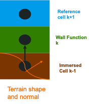

Theory Manual
=============

.. _governing_equations:

Governing equations
-------------------

Conservation of fluid mass:

.. math:: \frac{\partial \rho}{\partial t} + \nabla \cdot (\rho U)  = 0

Conservation of fluid momentum:

.. math:: \frac{ \partial (\rho U)}{\partial t} 
   + \nabla \cdot (\rho U U) + \nabla p = \nabla \cdot \tau + \rho g

Incompressibility constraint:

.. math:: \nabla \cdot U = 0

Tracer(s) advection:

.. math:: \frac{\partial \rho s}{\partial t} + \nabla \cdot (\rho U s)  = 0

.. _discretization:

Discretization
--------------

The numerical methodology used to solve the partial differential
equations (PDEs) within AMR-Wind is documented in `Almgren et
al. (JCP 1998)
<https://ccse.lbl.gov/Publications/almgren/abchw.pdf>`_. AMR-Wind uses
`AMReX-Hydro
<https://amrex-fluids.github.io/amrex-hydro/docs_html/Schemes.html>`_
for many advection routines. The reader is referred to their
documentation for implementation details.

Time Step -- MOL
~~~~~~~~~~~~~~~~

In the predictor

-  Define :math:`U^{MAC,n}`, the face-centered (staggered) MAC velocity which is used for advection, using :math:`U^n`

-  Define an approximation to the new-time state, :math:`(\rho U)^{\ast}` by setting 

.. math:: (\rho U)^{\ast} &= (\rho U)^n -  
           \Delta t \left( \nabla \cdot (\rho U^{MAC} U) + \nabla {p}^{n-1/2} \right) \\ &+ 
           \Delta t \left( \nabla \cdot \tau^n + \sum_p \beta_p (V_p - {U}^{\ast}) + \rho g \right)

-  Project :math:`U^{\ast}` by solving

.. math:: \nabla \cdot \frac{1}{\rho} \nabla \phi = \nabla \cdot \left( \frac{1}{\Delta t} 
          U^{\ast}+ \frac{1}{\rho} \nabla {p}^{n-1/2} \right)

then defining

.. math:: U^{\ast \ast} = U^{\ast} - \frac{\Delta t}{\rho} \nabla \phi

and 

.. math:: {p}^{n+1/2, \ast} = \phi

In the corrector

-  Define :math:`U^{MAC,\ast \ast}` at the "new" time using :math:`U^{\ast \ast}`

-  Define a new approximation to the new-time state, :math:`(\rho U)^{\ast \ast \ast}` by setting  

.. math:: (\rho U)^{\ast \ast \ast} &= (\rho U)^n - \frac{\Delta t}{2} \left( \nabla \cdot (\rho U^{MAC} U)^n + \nabla \cdot (\rho U^{MAC} U)^{\ast \ast}\right) + \\ &+ \frac{\Delta t}{2} \left( \nabla \cdot \tau^n + \nabla \cdot \tau^{\ast \ast \ast} \right) + \Delta t \left( - \nabla {p}^{n+1/2,\ast} + \sum_p \beta_p (V_p - {U}^{\ast \ast \ast}) + \rho g \right)

-  Project :math:`U^{\ast \ast \ast}` by solving

.. math:: \nabla \cdot \frac{1}{\rho} \nabla \phi = \nabla \cdot \left( \frac{1}{\Delta t} U^{\ast \ast \ast} + \frac{1}{\rho} \nabla {p}^{n+1/2,\ast} \right)

then defining

.. math:: U^{n+1} = U^{\ast \ast \ast} - \frac{\Delta t}{\rho} \nabla \phi

and 

.. math:: {p}^{n+1/2} = \phi

Time Step -- Godunov
~~~~~~~~~~~~~~~~~~~~

-  Define :math:`U^{MAC,n+1/2}`, the MAC velocity which is used for advection. This velocity is interpolated to the cell faces and extrapolated forward in time using a Taylor expansion. Then it is projected to form a divergence-free velocity field.

.. math:: u_f^{n+1/2} = u^n \pm \frac{\Delta x}{2}\frac{\partial u}{\partial x} &-
          \frac{\Delta t}{2}\left(u^n \frac{\partial u}{\partial x}
          + v^n \frac{\partial u}{\partial y} + w^n \frac{\partial u}{\partial z}\right)
          \\ &+
          \frac{\Delta t}{2}\left(g + \frac{1}{\rho^n}\left(
          -\frac{\partial p^{n-1/2}}{\partial x} + \mu\nabla^2u^n\right) \right)

.. math:: \nabla \cdot \frac{\nabla \phi}{\rho^n} = \nabla \cdot \boldsymbol{u}_f^{n+1/2}

.. math:: \boldsymbol{U}^{MAC,n+1/2} = \boldsymbol{u}_f^{n+1/2} - \frac{\nabla \phi}{\rho^n}

-  Time discretization of momentum governing equation

  - The time step goes from :math:`n` to :math:`n+1` with the right-hand-side at :math:`n+1/2`.
  - The time discretization of :math:`\boldsymbol{\tau}` depends on the method chosen to compute diffusion.

.. math:: (\rho \boldsymbol{U})^{n+1} = (\rho \boldsymbol{U})^n &-
           \Delta t \left( \nabla \cdot (\rho \boldsymbol{U} \otimes \boldsymbol{U}^{MAC})^{n+1/2}
           + \nabla {p}^{n+1/2} \right) \\ &+
           \Delta t \left( \nabla \cdot \boldsymbol{\tau} + \rho^{n+1/2} g \right)

-  Partition the discretized equation into two steps, the Predictor and Applying the Projection. The predicted state, :math:`\ast`, is an approximation to the new-time state, :math:`n+1`.

.. math:: (\rho \boldsymbol{U})^{\ast} = (\rho \boldsymbol{U})^n &-
           \Delta t \left( \nabla \cdot (\rho \boldsymbol{U} \otimes \boldsymbol{U}^{MAC})^{n+1/2}
           + \nabla {p}^{n-1/2} \right) \\ &+
           \Delta t \left( \nabla \cdot \boldsymbol{\tau} + \rho^{n+1/2} g \right)

.. math:: (\rho\boldsymbol{U})^{n+1} = (\rho\boldsymbol{U})^{\ast} + \Delta t \nabla p^{n-1/2} - \Delta t \nabla p^{n+1/2}

- In order to calculate :math:`\rho \boldsymbol{U}^{n+1/2}` within the advection term, the momentum must be interpolated to the faces and extrapolated forward in time a half step, similar to the face velocities involved in the MAC projection. To do this for the momentum, the routine uses the momentum, pressure gradients, source terms, and diffusion terms at :math:`n`, as well as :math:`\boldsymbol{U}^{MAC,n+1/2}`.

- In the case of variable density single-phase or multiphase simulations, the density at :math:`n+1` is found using separate scalar equations, which are solved during the predictor step. Because density has no projection step,

.. math:: \rho^{n+1} = \rho^{\ast}.

Therefore, the equation that applies the new pressure gradient becomes

.. math:: \boldsymbol{U}^{n+1} = \boldsymbol{U}^{\ast} + \frac{1}{\rho^{n+1}}\left(\Delta t \nabla p^{n-1/2} - \Delta t \nabla p^{n+1/2}\right)

- The pressure gradient at :math:`n+1/2` is found by solving the projection

.. math:: \nabla \cdot \frac{1}{\rho^{n+1}} \nabla p^{n+1/2} = \nabla \cdot \left( \frac{1}{\Delta t}
          \boldsymbol{U}^{\ast}+ \frac{1}{\rho^{n+1}} \nabla {p}^{n-1/2} \right)

Solving physics on a stretched AMReX mesh
------------------------------------------

Often for simulations involving walls, (e.g., channel flows, complex terrains etc.) it is desirable to have finer mesh near the wall which gradually coarsens only in the wall-normal direction. Consequently, modifications within AMR-Wind are underway to support solving a non-uniformly spaced mesh while still using most of AMReX's machinery directed at uniformly-spaced Cartesian meshes. The governing equations solved on a non-uniform stretched mesh are further explained below -

.. toctree::
   :glob:
   :maxdepth: 2

   mapping.rst

.. _multiphase:

Multiphase flow modeling
------------------------

AMR-Wind employs the volume-of-fluid method for simulating two-phase (water-air) flows. 
More specifically, the volume fraction field is advected explicitly using a
directional split geometric approach, and the advection of momentum is 
discretized in a mass-consistent manner. Overall, this approach conserves mass
and momentum while remaining stable at high density ratios (typically 1000).
Viscosities can be specified for each fluid independently, but surface tension
is not modeled by AMR-Wind currently. For further detail, see 
`Kuhn, Deskos, Sprague (Computers & Fluids 2023)
<https://doi.org/10.1016/j.compfluid.2022.105770>`_.

.. _source_terms:

Source terms
------------

Gravity Forcing
~~~~~~~~~~~~~~~~

The implementation of this source term allows the user to choose the full gravity term (:math:`\rho g`) or a perturbational form (:math:`(\rho - \rho_0) g`). By default, the full term is used, but the perturbational form can be turned on by adding ``ICNS.use_perturb_pressure = true`` to the input file.

The reference density (:math:`\rho_0`) is defined as ``1.0`` by default, can be defined as a constant through the input argument, ``incflo.density``, or can be defined as a spatially varying field within the flow setup (see physics/multiphase/Multiphase.cpp).

Using the perturbational form implies that the hydrostatic pressure is removed from the pressure variable, including its output. This means that the solution to the Poisson equation is actually the perturbational pressure, :math:`p'`, not :math:`p`. If the full pressure, :math:`p`, is desired for analysis or postprocessing purposes, the hydrostatic pressure can be added back to the pressure field via the input argument ``ICNS.reconstruct_true_pressure = true``. In order for this to operate in the code, the reference pressure field must be defined for the specific flow case being run. 

- An example of this is in physics/multiphase/Multiphase.cpp. To construct the reference pressure field, the reference gravity term must be integrated. This particular example assumes that the reference density only varies in z (or is constant), gravity acts only in z, and the hydrostatic pressure at the high z boundary is equal to 0. 

- In mathematical form, the derivation and calculation of the full pressure is as follows:

.. math:: \nabla p = \nabla p' + \rho_0 \boldsymbol{g}

- assume :math:`\boldsymbol{g} = g\hat{k}` and :math:`\frac{dp_0}{dz} = g\hat{k}`

.. math:: p = p' + \int_{z_{min}}^z \rho_0 g dz + p(z = z_{min}) 

- change reference frame to the top boundary, and assume :math:`p(z = z_{max}) = 0`
   
.. math:: p = p' - \int_z^{z_{max}} \rho_0 g dz + p(z = z_{max}) = p' - \int_z^{z_{max}} \rho_0 g dz

.. _mesoscale_forcing:

Mesoscale Forcing
~~~~~~~~~~~~~~~~~

To incorporate larger-scale atmospheric dynamics under real conditions,
`AMR-Wind` offers two approaches. If mesoscale momentum and/or temperature
source terms are known exactly, e.g., from a numerical weather prediction (NWP)
model, then these may be directly applied. These mesoscale source terms would
come from the RHS of the mesoscale equations of motion and may also include the
effects of additional modeled physics such as radiation or moisture. This
mesoscale forcing approach is called the "tendencies" (or "mesoscale budget
components") approach. For more information, see `Draxl et al. (BLM 2021)
<https://doi.org/10.1007/s10546-020-00584-z>`_

If the mesoscale source terms are not known a priori, they may be derived on
the fly with a profile assimilation technique. This is an engineering approach
that applies a proportional controller to drive the instantaneous planar
averaged wind and/or temperature profiles towards known time--height data. This
approach can be used with NWP model output or observational data. For more
information, see `Allaerts et al. (BLM 2020)
<https://doi.org/10.1007/s10546-020-00538-5>`_

The application of these forcing approaches is detailed :ref:`here <inputs_meso_forcing>`.

Actuator Forcing
~~~~~~~~~~~~~~~~

Calculating actuator forces relies on sampling the velocity field at actuator points
at the beginning of each time step (*n*). Actuator-based models, i.e., actuator lines
and actuator disks, rely on internal implementations (e.g., Joukowsky disk, actuator-line wing)
or external turbine tools (OpenFAST) that use these sampled velocities to calculate forces 
and the motion of actuator points.
When the Godunov method is used, the motion of actuator points must be incorporated
into the application of actuator forces. This is because the Godunov method discretizes source terms
at the half time step (*n+1/2*). Therefore, the actuator force vectors are calculated using 
fluid velocities at *n*, and these actuator forces are applied at locations corresponding
to *n+1/2*.

.. _turbulence:

Turbulence Models
-----------------

RANS models
~~~~~~~~~~~~~

The RANS models are available in two flavors: wall-modeled and wall-resolved. The former model is 
designed for cases with :math:`y+ > 30` while the latter requires :math:`y+ < 5`. The wall-modeled RANS 
model available in AMR-Wind is based on the work of `Axell and Liungman (EFM 2001 ) <https://link.springer.com/article/10.1023/A:1011560202388>`_.
The code also includes Menter's K-Omega SST model with IDDES support. 

Axell One-Equation RANS Model 
^^^^^^^^^^^^^^^^^^^^^^^^^^^^^^^

The one-equation model solves the transport equation for turbulent kinetic energy (TKE). The length scale is computed using algebraic equations. 
The transport equation for TKE is given by: 

.. math:: \frac{ \partial (\rho k)}{\partial t} 
   + \nabla \cdot (\rho U k)  =  P_s + P_b - \epsilon + D 

Here :math:`P_s` is the shear production term, :math:`P_b` is the buoyancy production/destruction term, :math:`\epsilon` is the turbulent dissipation 
rate and :math:`D` is the turbulent diffusion term. These terms are computed as follows 

.. math:: P_s= \nu_t S^2

.. math:: P_b= -{\nu_t}^{'} N^2 

.. math:: \epsilon= C_0 \frac{k^3/2}{L}

.. math:: D = \frac{\partial}{\partial x_j} [(\nu+\nu_t)\frac{\partial U_j}{\partial x_i}]

Here :math:`P_s` is the strain rate, :math:`P_b` is the buoyancy frequency and :math:`L` is the length scale computed algebraically.
The strain rate and buoyancy frequency are computed using the same method used in the literature and are not repeated here. The 
length scale is computed as follows: 

.. math:: \frac{1}{L^2} = \frac{1}{Ls^2} + \frac{1}{Lb^2}

The shear length scale is given by :math:`Ls=\kappa z`. An upper limit can be imposed for the shear length scale to avoid excessive values. 
In the current model, it is set to 30 and can be modified to be computed from Geostrophic wind too. The buoyancy length scale is given by 

.. math:: Lb = Cb \frac{\sqrt{k}}{N} 

The implementation methodology is different for stable/neutral and unstable stratification and follows the recommendation in the paper. The
turbulent viscosity is computed as follows: 

..  math:: \nu_t = C_\mu \sqrt{k} L 

..  math:: {\nu_t}^{'} = {C_\mu}^{'} \sqrt{k} L 

Here :math:`C_\mu` and :math:`{C_\mu}^{'}` are non-uniform model constants which depend on :math:`C_0` and turbulent Richardson number 
:math:`Rt`. The calculations of these terms can be found in the reference. The turbulent Prandtl number also depends on the turbulent 
Richardson number and is computed using am empirical expression from the reference. The boundary condition for TKE at the lower boundary 
is given by: 

.. math:: k = k_w ^ {(2/3)}

.. math:: k_w = \frac{{u_*}^{3}}{{C_0}^3} + \frac{\max{(Q,0)}\kappa d_1}{{C_0}^3}

Here :math:`Q` is the sensible heat flux at the surface and :math:`d_1`  is the near-wall distance. For cases with terrain, there is also 
a check for near-wall distance from the surface of the terrain. The wall boundary condition is implemented as a forcing term at the first cell 
above the lower surface and terrain. 

LES models for subgrid scales
~~~~~~~~~~~~~~~~~~~~~~~~~~~~~
Smagorinsky model
^^^^^^^^^^^^^^^^^

Simple eddy viscosity model, the dissipation is calculated using the
resolved strain rate tensor and the grid resolution as

.. math::

   \begin{aligned}
       \tau_{ij} &= -2 \nu_t \widetilde{S}_{ij} \\
       \nu_t &= C_s^2 \Delta^2 (2 \langle S_{ij} S_{ij} \rangle)^{\frac{1}{2}}
   \end{aligned}

AMDNoTherm model
^^^^^^^^^^^^^^^^^
This is the implementation of the base AMD model, useful for flows without a temperature field.

The eddy viscosity is calculated using an anisotropic derivative with a
different filter width in each direction

.. math::

   \begin{aligned}
       \hat{\partial}_i &= \sqrt{C} \delta_i \partial_i \textrm{ for } i=1,2,3 \\
       C &= 1/3, \textrm{ Poincare coefficient for } 2^{nd} \textrm{ order gradient} \\
       \delta_i &= \textrm{Filter width along dimension } i \textrm{ for anisotropic grids}
   \end{aligned}

The anisotropic derivative is used to define the eddy viscosity as

.. math::

   \begin{aligned}
       \tau_{ij} &= -2 \nu_t \widetilde{S}_{ij} \\
       \nu_t &= \frac{- (\hat{\partial}_k \widetilde{u}_i) (\hat{\partial}_k \widetilde{u}_j) \widetilde{S}_{ij}}{ (\partial_l \widetilde{u}_m) (\partial_l \widetilde{u}_m) }
   \end{aligned}

AMD model (for ABL)
^^^^^^^^^^^^^^^^^^^

The eddy viscosity is calculated using an anisotropic derivative with a
different filter width in each direction

.. math::

   \begin{aligned}
       \hat{\partial}_i &= \sqrt{C} \delta_i \partial_i \textrm{ for } i=1,2,3 \\
       C &= 1/3 \textrm{ Poincare coefficient for } 2^{nd} \textrm{ order gradient} \\
       \delta_i &= \textrm{Filter width along dimension } i \textrm{ for anisotropic grids}\\
       \beta &= g/\Theta_0 \textrm{ Gravity constant over reference temperature}
   \end{aligned}

The anisotropic derivative is used to define the eddy viscosity as

.. math::

   \begin{aligned}
       \tau_{ij} &= -2 \nu_t \widetilde{S}_{ij} \\
       \nu_t &= \frac{- (\hat{\partial}_k \widetilde{u}_i) (\hat{\partial}_k \widetilde{u}_j) \widetilde{S}_{ij} +  \beta (\hat{\partial}_k \widetilde{w}) (\hat{\partial}_k (\widetilde{\Theta} - \langle {\widetilde{\Theta}} \rangle) )  }{ (\partial_l \widetilde{u}_m) (\partial_l \widetilde{u}_m) } \\
       \tau_{\theta j} &= -2 D_e \frac{\partial \widetilde{\Theta}}{\partial x_j} \\
       D_e &= \frac{- (\hat{\partial}_k \widetilde{u}_i) (\hat{\partial}_k \widetilde{\Theta}) \partial_i \widetilde{\Theta} }{(\partial_l \widetilde{\Theta}) (\partial_l \widetilde{\Theta})}
   \end{aligned}

- **Unit tests**

There is a simple unit test for both :math:`\nu_t` and :math:`D_e` in
``unit_tests/turbulence/test_turbulence_LES.cpp`` under
``test_AMD_setup_calc``.

Non-linear Sub-grid Scale Model 
^^^^^^^^^^^^^^^^^^^^^^^^^^^^^^^
The non-linear model extends the Smagorinsky model by including an extra term computed from the strain and vorticity rate. 
The modification proposed by `Branco (JFM 1997) <https://doi.org/10.1017/S0022112096004697>`_ and implemented in WRF (`Mirocha et. al (MWR 2010) <https://doi.org/10.1175/2010MWR3286.1>`_) 
is the model considered. The sub-grid scale stress tensor is calculated as follows: 

 .. math::
    M_{ij}= -(C_s \Delta)^2 
    [
      2(2S_{mn}S_{mn})^{1/2}S_{ij}+C_1(S_{ik}S_{kj}-\frac{1}{3}S_{mn}S_{mn} \delta_{ij})
      +C_2(S_{ik}R_{kj}-R_{ik}S_{kj})
    ]

Here :math:`S_{ij}` is the strain-rate tensor and :math:`R_{ij}` is the vorticity rate tensor. The model constants are: 
:math:`C_s=[8*(1+C_b)/27\pi^2]^{1/2}`, :math:`C_1=C_2=960^{1/2}C_b/7(1+C_b)S_k`, :math:`S_k=0.5`, and :math:`C_b=0.36`.  

The default length scale of :math:`L=C_s\Delta` causes over-prediction of the mean wind speed profiles. To avoid this over-prediction, the
length scale is modified as follows 

.. math::
   L=(1-\exp(-z/H))^2(\frac{\kappa z}{\phi_M})^2+(\exp(-z/H))^2(C_s \Delta)^2

Here the term :math:`H=1.5 dz` specifies the location at which the length scale switches to :math:`L=C_s\Delta` and :math:`\phi_M`
is the atmospheric stability function. Currently, the implementation for the stability function uses a single global value. 
The implementation of the non-linear model is split into two parts. The subgrid-scale viscosity term is directly used 
within the ``AMR-Wind`` diffusion framework. The last two terms in :math:`M_{ij}` are added as source-terms in the momentum equation. 

.. _wall_models:

Wall models
-----------
The wall models described in this section are implemented in ``AMR-Wind`` for
running wall-bounded flows.

Monin-Obukhov Similarity Theory
~~~~~~~~~~~~~~~~~~~~~~~~~~~~~~~
Monin-Obukhov similarity theory is used for wall boundary conditions for ABL simulations. The exact
calculation of :math:`\tau_{i3}` in the horizontal directions depends on the SGS model used, but the following calculations for the friction velocity :math:`u_\tau` and surface heat flux `q` are common across the models.

.. math::
    u_\tau = \frac{\kappa \overline{s}}{\ln \left(\frac{z_b}{z_0}\right) - \psi_m}
    
where :math:`s` is the horizontal wind speed :math:`s = \sqrt{u_{1}^2+ u_{2}^2}`, :math:`\theta_w`
is the wall temperature, :math:`\kappa` is the von Karman constant, and :math:`z_0` is the surface roughness length and :math:`z_b` is the reference height (default is the first cell center). The
:math:`\overline{\phantom{l}.\phantom{l}}` operator indicates a horizontal plane
average.  The quantities :math:`\psi_m, \psi_h` are computed using the Monin-Obukhov similarity law
following the calculations in `ven der Lann et al <https://doi.org/10.1002/we.2017>`_ and `Dyer (1974)` formulation  for unstable stratification (:math:`z_b/L < 0`):

.. math::
    \begin{align}
        \psi_m &= 2\ln \left(\frac{1+x}{2}\right) + \ln \left(\frac{1+x^2}{2}\right) - 2 \arctan{x} + \frac{\pi}{2}, x = \left(1 - \beta_m\frac{z_b}{L}\right)^{\frac{1}{4}} \\
        \psi_h &= \ln \left( \frac{1 + y}{2}\right), y = \left(1 - \beta_h \frac{z_b}{L}\right)^{\frac{1}{2}},
    \end{align}

and for stable stratification (:math:`z_b/L > 0` ):

.. math::
    \begin{align}
        \psi_m &= -\gamma_m \frac{z_b}{L},\\
        \psi_h &= -\gamma_h \frac{z_b}{L},
    \end{align}

where :math:`L = -\frac{u_\tau^3 \theta_0}{\kappa g q}` is the Monin-Obukhov length and :math:`\beta_m, \beta_h, \gamma_m, \gamma_h` are model constants. AMR-Wind uses :math:`\beta_m = \beta_h = 16` and :math:`\gamma_m = \gamma_h = 5`.

Log-law wall model
~~~~~~~~~~~~~~~~~~

This wall model computes the local :math:`u_\tau` from the velocity at
the first grid cell, and uses this to compute the shear stress, which is
then used as a boundary condition.

The log law:

.. math:: u_{\mathrm{mag}} = u_\tau \left(\frac{1}{\kappa}\log\left(\frac{u_\tau z}{\nu}\right) + B\right). \label{eq:loglaw}

Given a horizontal velocity magnitude
:math:`u_{\mathrm{mag}} = \sqrt{u^2 + v^2}` at
:math:`z = z_{\mathrm{ref}}`, :math:`u_\tau` can be computed using a
non-linear solve to satisfy `[eq:loglaw] <#eq:loglaw>`__.

In ``AMR-Wind`` Newton-Raphson iterations are used with a convergence
criterion of :math:`\lvert u_\tau^{n+1} - u_\tau^n \rvert < 10^{-5}`.
For this, derivative of
:math:`\frac{\partial u_{\mathrm{mag}}}{\partial {u_\tau}}` is used,

.. math:: \frac{\partial u_{\mathrm{mag}}}{\partial {u_\tau}} = \left(\frac{1}{\kappa}\left(1+\log\left(\frac{u_\tau z_{\mathrm{ref}}}{\nu}\right)\right) + B\right)

.. math:: u_\tau^{n+1} = u_\tau^{n} - \left(u_\tau^n \left(\frac{1}{\kappa}\log\left(\frac{u_\tau^n z_{\mathrm{ref}}}{\nu}\right) + B\right) - u_{\mathrm{mag}}\right)/\frac{\partial u_{\mathrm{mag}}}{\partial {u_\tau}}.

Finally, the shear stress is calculated as,

.. math::

   \begin{aligned}
       \tau_{xz} &= u_\tau^2 \frac{u}{u_\mathrm{mag}} \\
       \tau_{yz} &= u_\tau^2 \frac{v}{u_\mathrm{mag}}
   \end{aligned}

Constant stress model
~~~~~~~~~~~~~~~~~~~~~

NOTE: This wall model will be ill-posed unless combined with a Dirichlet
boundary condition on the other wall, :math:`\langle u \rangle` can
drift by a constant otherwise.

This is a trivial wall model, where the shear stresses are specified as
constants. For a pressure gradient driven channel,

.. math::

   \begin{aligned}
       u_\tau^2 &= -\frac{\mathrm{d} P}{\mathrm{d} x} \\
       \tau_{xz} &= u_\tau^2 \\
       \tau_{yz} &= 0
   \end{aligned}

Schumann model
~~~~~~~~~~~~~~

NOTE: This wall model will be ill-posed unless combined with a Dirichlet
boundary condition on the other wall, :math:`\langle u \rangle` can
drift by a constant otherwise.

This model is a modified version of the constant stress model, where the
fluctuations from a reference height :math:`z_\mathrm{ref}` are used to
add fluctuations in the shear stress.

.. math::

   \begin{aligned}
       u_\tau^2 &= -\frac{\mathrm{d} P}{\mathrm{d} x} \\
       \tau_{xz} &= u_\tau^2 \frac{u}{\langle u_\mathrm{mag} \rangle} \\
       \tau_{yz} &= u_\tau^2 \frac{v}{\langle u_\mathrm{mag} \rangle}
   \end{aligned}

where, :math:`\langle u_\mathrm{mag} \rangle` is the planar average of
:math:`u_{\mathrm{mag}} = \sqrt{u^2 + v^2}` at :math:`z_\mathrm{ref}`.

Symmetric wall boundary
~~~~~~~~~~~~~~~~~~~~~~~

This is a boundary condition to for flows with a symmetry across the
z direction (example: *half-channel* simulations) at the centerline.

.. math::

   \begin{aligned}
       \tau_{xz} &= 0 \\
       \tau_{yz} &= 0 \\
       w &= 0
   \end{aligned}

Dynamic wall model (Wave model)
~~~~~~~~~~~~~~~~~~~~~~~~~~~~~~~

This wall model is used to calculate the stress due to moving surfaces,
like ocean waves. It aims to introduce wave phase-resolving physics 
at a cost similar to using the Log-law wall model, without the need of using
wave adapting computational grids. The model was developed by `Ayala et al. (2024) <https://doi.org/10.1007/s10546-024-00884-8>`_.

.. math:: \tau_{i3} = \frac{1}{\pi}|(\boldsymbol{u-C}) \cdot \boldsymbol{\hat{n}}|^2|\boldsymbol{\nabla} \eta|^2 \, \hat{n}_i  \, \text{H} \Bigl[ (u_j-C_j)\frac{\partial \eta}{\partial x_j} \Bigr] \, + \, \tau^{visc}_{i3}, \quad i = 1,2.

The first component gives the form drag due to ocean waves, where :math:`\boldsymbol{C}`
is the wave velocity vector, :math:`\eta` is the surface height distribution and
:math:`\hat{\boldsymbol n} = \boldsymbol{\nabla} \eta /|\boldsymbol{\nabla} \eta|`. The
second component (:math:`\tau^{visc}_{i3}`) is the stress due to unresolved effects,
like viscous effects. For this component, the ``Log-law wall model`` is used.

.. _terrainmodel:

Terrain Model
--------------

An immersed boundary forcing method (IBFM) is used to represent the terrain. In this method,
the effect of the terrain is modeled using a forcing term in the momentum and energy equation. 

The forcing term in the momentum equation is given by: 

.. math::

   F_i = - \beta C_d u_i | u_i | 

Here :math:`\beta` is the volume fraction of the cell covered by terrain, :math:`C_d` is a drag
term  and :math:`u_i` is the wind speed. Currently, the volume fraction is 
computed as a 0 or 1 using a simple nearest cell algorithm at each grid level. Future, updates 
will incorporate the partial terrain overlap using the EB capability in AMReX. The calculation 
of the drag coefficient term and the forcing term for the energy equation can be found in 
`Muñoz‐Esparza, Domingo, et al.  (JAMS 2020) <https://agupubs.onlinelibrary.wiley.com/doi/full/10.1029/2020MS002141>`_.

The original formulation is designed for low Reynolds number cases and does not include a 
method for applying a wall function. We propose the use of a forcing function to include 
the wall effects. 

First, compute the friction velocity from location k+1: 

.. math::

   u_*= |u_i[k+1]| \frac {\kappa}{\log [(z_{k+1}-z_k)/z0]}

The expected wind speed at cell k is computed as follows: 

.. math::

   |u_n|= \frac{u_*}{\kappa} \log [0.5 (z_{k+1}-z_k)/z0]

The methodology can be extended to include stability functions in a straight forward manner. The forcing 
term is computed as 

.. math::

   F_i= - \frac {|u[k]| \hat{c} - |u_n|\hat{l}} {\tau}

Here :math:`\hat{c}=(1,1,1)` is the existing normal vector from the grid and :math:`\hat{l}=(ux,uy,0)/|u_n|` is the value 
from the log law. The calculation of :math:`\hat{l}` and :math:`u_*` can be modified in the future align with the normal (following 
the orange arrow below).

Forest Model
--------------
The forest model provides an option to include the drag from forested regions to be included in the momentum equation. The 
drag force is calculated as follows: 

.. math::

   F_i= - C_d L(x,y,z) U_i | U_i |

Here :math:`C_d` is the coefficient of drag for the forested region and :math:`L(x,y,z)` is the leaf area density (LAD) for the 
forested region. A three-dimensional model for the LAD is usually unavailable and is also cumbersome to use if there are thousands
of trees. Two different models are available as an alternative: 

.. math::
   L=\frac{LAI}{h}

.. math:: 
   L(z)=L_m \left(\frac{h - z_m}{h - z}\right)^n  exp\left[n \left(1 -\frac{h - z_m}{h - z}\right )\right]

Here :math:`LAI` is the leaf area index and is available from measurements, :math:`h` is the height of the tree, :math:`z_m` is the location 
of the maximum LAD, :math:`L_m` is the maximum value of LAD at :math:`z_m` and :math:`n` is a model constant with values  6 (below :math:`z_m`) and 0.5 
(above :math:`z_m`), respectively. :math:`L_m` is computed by integrating the following equation: 

.. math::
   LAI = \int_{0}^{h} L(z) dz 

The simplified model with uniform LAD is recommended for forested regions with no knowledge of the individual trees. LAI values can be used from 
climate model look-up tables for different regions around the world if no local remote sensing data is available. 

Navigating source code
------------------------

``AMR-Wind`` is built on top of `AMReX library
<https://amrex-codes.github.io/amrex/docs_html/>`_. Users are strongly
recommended to read through the AMReX documentation and understand the basic
AMReX concepts before jumping into the AMR-Wind source code.

The `Basics section
<https://amrex-codes.github.io/amrex/docs_html/Basics_Chapter.html>`_ provides a
thorough overview of the basic data structures and ways to interact with these
structures. The `GPU section
<https://amrex-codes.github.io/amrex/docs_html/GPU_Chapter.html>`_ provides an
overview of the AMReX GPU strategy and the higher-level functions (e.g.,
``parallel-for`` abstractions) available to write GPU-ready code within
AMR-Wind. The `Linear Solvers section
<https://amrex-codes.github.io/amrex/docs_html/LinearSolvers_Chapter.html>`_
provides an overview of the multi-level multigrid (MLMG) solvers used to solve
the various linear systems within AMR-Wind.
