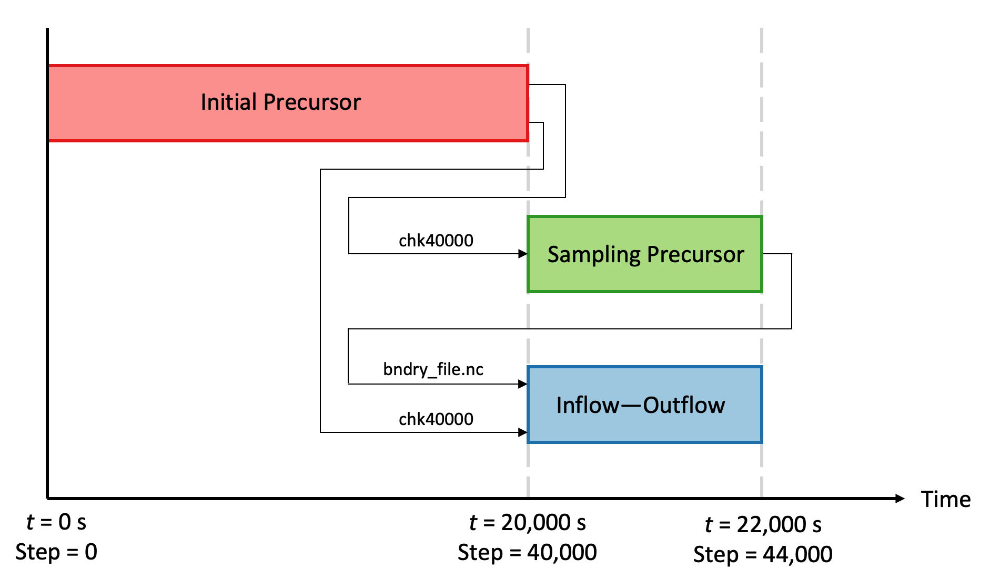

.. _examples:

Examples
========

Inflow--Outflow Example
-----------------------

This example demonstrates the use of inflow and outflow boundary conditions in AMR-Wind.  While periodic boundary conditions are appropriate for atmospheric boundary layer (ABL) flows, the presence of turbine wakes necessitates conditions at the outlet that are different from those at the inlet.  Since an analytical prescription of the turbulent fluctuations at the inlet is not realistic, the inlet conditions are typically sampled from an independent ABL simulation with periodic boundary conditions; this independent ABL simulation is known as a "precursor."  Since the sampling is expensive and currently scales very poorly with the number of cores, it is typically done as a separate run with fewer cores.  The phases for the complete simulation are then:

#. Inital Precursor

#. Sampling Precursor

#. Inflow--Outflow 

Each of these phases will be discussed independently in later sections.

Case Overview
~~~~~~~~~~~~~

The example case is a typical ABL flow with a modeled turbine.  The domain is 5 km X 5 km X 1 km, and is discretized with 512 X 512 X 128 elements.  The Smagorinsky turbulence model is used.  The precursors are periodic in x and y, while the inflow--outflow simulation is periodic in y and has inflow and outflow BCs on the x-normal boundaries.  The turbine is located at {1500, 2500, 0}, and has a hub height of 90 m.  The initial precursor proceeds for the first 20,000 seconds.  The sampling precursor picks up from a checkpoint file ``chk40000`` written at the end of the initial precursor, proceeds for an additional 2000 seconds, writing boundary data for the xlo and ylo planes to the ``bndry_file.nc`` file.  Finally, the inflow--outflow simulation runs through that same 2000 seconds, starting from the same ``chk40000`` flow state, but uses the boundary plane data to form the xlo boundary condition.  A diagram of the time history and data flow of the complete simulation is shown below.

Initial Precursor
~~~~~~~~~~~~~~~~~

File: ``examples/abl_turbine/precursor/precursor.i``

The first phase simulates the evolution of the ABL flow from analytically prescribed initial conditions to a statistical steady state.  This phase will usually use periodic boundary conditions in both the x and y directions.  No special syntax is required; this phase is a typical ABL simulation.  

In the example input file, the simulation ends at a time of 20,100 seconds.  

.. code-block:: none
   
   time.stop_time = 20100.0

This is done to slightly exceed a time 20,000 seconds, which is the start time for second and third phases.  This line:

.. code-block:: none
   
   time.checkpoint_interval = 5000

causes a checkpoint to be written every 5000 steps.  With a fixed precursor timestep of 0.5 seconds, it follows that the last checkpoint will be written at step 40,000: ``chk40000``.  This checkpoint file is the key output of the first phase of the simulation, and the second and third phases will be restarted from that file.  The boundary conditions for this initial phase (as well as the sampling phase) are periodic in x and y, a fixed wall using a wall model on zlo, and a slip will with zero temperature gradient on zhi.

.. code-block:: none

   geometry.is_periodic = 1 1 0
   ...
   zlo.type = "wall_model"
   zhi.type = "slip_wall"
   zhi.temperature_type = "fixed_gradient"
   zhi.temperature = 0.0

Sampling Precursor
~~~~~~~~~~~~~~~~~~

File: ``examples/abl_turbine/precursor2/precursor2.i``

The second phase picks up from the last checkpoint of the first phase, using the line:

.. code-block:: none
   
   io.restart_file = "../precursor/chk40000"

The following code block is required to sample the boundary data:

.. code-block:: none

   ABL.bndry_file = "bndry_file.nc"
   ABL.bndry_io_mode = 0
   ABL.bndry_planes = ylo xlo
   ABL.bndry_output_start_time = 2.0
   ABL.bndry_var_names = velocity temperature

Let's look at these lines individually:

   - The ``ABL.bndry_file`` variable indicates where the sampled data will be written to.  It will be formatted with NetCDF, so it is given the extension ".nc".  

   - The ``ABL.bndry_io_mode`` variable is set to 0 to indicate "write."  In the third phase of the simulation, it will be set to 1 to indicate "read."  

   - The ``ABL.bndry_planes`` variable indicates which boundary planes are sampled.  Note: currently, only the lower x and y boundaries may be used.

   - The ``ABL.bndry_output_start_time`` variable indicates when data collection will begin.  This is set to 20,000 seconds, since that is the time of the checkpoint file we're using.

   - The ``ABL.bndry_var_names`` indicates which flow variables should be sampled.  This should include everything needed for the specific models you are using.  In this case, we require only velocity and temperature.

The boundary conditions for the second phase are identical to those of the first phase.

The second phase of the simulation ends at a time of 22,000 seconds:

.. code-block:: none

   time.stop_time = 22000.0

Note that the time domain for the inflow--outflow phase MUST be contained within the sampled time domain. Note also that the same grid resolution must be used for the boundary plane in the inflow--outflow phase as was used in the sampling phase. (Here we simply use the same resolution overall.)

Inflow--Outflow
~~~~~~~~~~~~~~~

File: ``examples/abl_turbine/abl_turbine/abl_bndry_input.i``

The third and final phase of the simulation restarts from the same checkpoint as the second phase:

.. code-block:: none
   
   io.restart_file = "../precursor/chk40000"

This line tells AMR-Wind to use the sampling NetCDF file from the second phase to form the xlo and ylo boundary conditions:

.. code-block:: none
   
   ABL.bndry_file = "../precursor2/bndry_file.nc"

The flow variables that were sampled during the second phase are included here as well:

.. code-block:: none
   
   ABL.bndry_var_names = velocity temperature

Notice that the base resolution for this phase is the same as that of the second phase:

.. code-block:: none
   
   amr.n_cell = 512 512 128

The boundary condition for the y-normal boundaries are periodic, while the xlo boundary is given a "mass_inflow" condition (using the sampling) and the xhi boundary is given a "pressure_outflow" condition.

.. code-block:: none
   
   amr.is_periodic = 0 1 0
   xlo.type = "mass_inflow"
   xlo.density = 1.0
   xlo.temperature = 0.0
   xhi.type = "pressure_outflow"

This example also contains a model turbine:

.. code-block:: none

   Actuator.labels = WTG01
   Actuator.type = TurbineFastLine
   Actuator.TurbineFastLine.rotor_diameter = 126.0
   Actuator.TurbineFastLine.hub_height = 90.0
   Actuator.TurbineFastLine.num_points_blade = 64
   Actuator.TurbineFastLine.num_points_tower = 12
   Actuator.TurbineFastLine.epsilon = 5.0 5.0 5.0
   Actuator.TurbineFastLine.openfast_start_time = 0.0
   Actuator.TurbineFastLine.openfast_stop_time = 2000.0
   Actuator.TurbineFastLine.nacelle_drag_coeff = 0.0
   Actuator.TurbineFastLine.nacelle_area = 0.0
   Actuator.TurbineFastLine.output_frequency = 10
   Actuator.TurbineFastLine.density = 1.225
   Actuator.WTG01.base_position = 1500.0 2500. 0.0
   Actuator.WTG01.openfast_input_file = "fast_inp/nrel5mw.fst"

Mesh refinement is also prescribed in the neighborhood of the turbine.  However, this refinement region should not be allowed to extend to the inlet, where it may interfere with the sampling plane.

.. code-block:: none

   tagging.labels            = refine0
   tagging.refine0.type      = GeometryRefinement
   tagging.refine0.shapes    = c0 c1
   tagging.refine0.c0.type   = box
   tagging.refine0.c0.origin = 1300 2300 0
   tagging.refine0.c0.xaxis  = 400   0   0
   tagging.refine0.c0.yaxis  =   0 400   0
   tagging.refine0.c0.zaxis  =   0   0 400
   tagging.refine0.c1.type   = box
   tagging.refine0.c1.origin = 1400 2400 0
   tagging.refine0.c1.xaxis  = 200   0   0
   tagging.refine0.c1.yaxis  =   0 200   0
   tagging.refine0.c1.zaxis  =   0   0 200

This generates two nested refinement regions.  The first is a cube aligned with the coordinate axes, with an edge length of 400 meters, centered around coordinates {1500, 2500, 200}.  (The syntax equivalently provides a corner and the edge vectors.) The second is a cube aligned with the coordinate axes, with an edge length of 200 meters, centered around coordinates {1500, 2500, 100}.  From the turbine inputs, the turbine hub is located at coordinates {1500, 2500, 90}, and the rotor has a radius of 63 meters.  Hence, the turbine is completely enclosed inside the innermost refinement region (c1).  Note that issues have arisen in cases where the refinement regions are not completely nested, so in practice, choose the refinement regions to be completely nested, such that adjacent elements are no more than one generation different.

