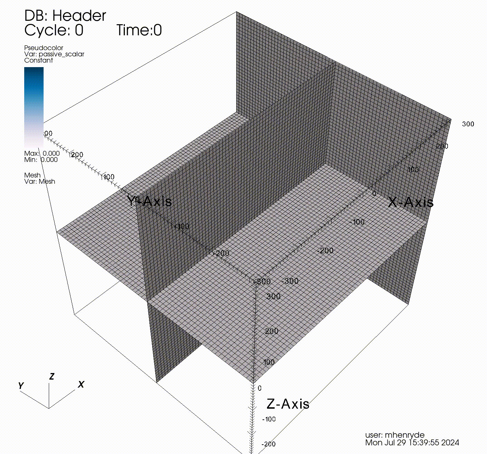

.. _inputs_actuator:

Section: Actuator
~~~~~~~~~~~~~~~~~

This section controls  the actuator type models. This includes the actuator
disk and line models. The prefix is the label set in
``incflo.physics``. For example
``incflo.physics = FreeStream Actuator``
Actuator models are meant to simulate aerodynamic objects by using body forces
in the momentum equation.
There are capabilities to simulate fixed wings as actuator lines and wind
turbines as actuator disks and actuator line models.

.. input_param:: Actuator.labels

   **type:** String, mandatory

   This string is used as an identifier for the current actuator.

.. input_param:: Actuator.type

   **type:** String, mandatory

   This string identifies the type of actuator to use. The ones currently
   supported are: ``TurbineFastLine``, ``TurbineFastDisk``, and
   ``FixedWingLine``.

It is recommended to group common parameters across actuators using the ``Actuator.[type].[param]``. For example::

   Actuator.Turb1.type            = UniformCtDisk"
   Actuator.Turb1.epsilon         = 5.0 5.0 5.0"
   Actuator.Turb2.type            = UniformCtDisk"
   Actuator.Turb2.epsilon         = 5.0 5.0 5.0"

becomes::

   Actuator.UniformCtDisk.epsilon = 5.0 5.0 5.0"
   Actuator.Turb1.type            = UniformCtDisk"
   Actuator.Turb2.type            = UniformCtDisk"

FixedWingLine
"""""""""""""

Example for ``FixedWingLine``::

   incflo.physics = FreeStream Actuator
   Actuator.labels = F1
   Actuator.type = FixedWingLine
   Actuator.FixedWingLine.num_points = 21
   Actuator.FixedWingLine.epsilon = 3.0 3.0 3.0
   Actuator.FixedWingLine.epsilon_chord = 0.25 0.25 0.25
   Actuator.FixedWingLine.fllc = 0
   Actuator.FixedWingLine.pitch = 4.0
   Actuator.FixedWingLine.span_locs = 0.0 1.0
   Actuator.FixedWingLine.chord = 2.0 2.0
   Actuator.FixedWingLine.airfoil_table = DU21_A17.txt
   Actuator.FixedWingLine.airfoil_type = openfast
   Actuator.F1.start = 0.0 -4.0 0.0
   Actuator.F1.end = 0.0 4.0 0.0
   Actuator.F1.output_frequency = 10
   ICNS.source_terms = ActuatorForcing

.. input_param:: Actuator.FixedWingLine.num_points

   **type:** int, mandatory

   This is the number of actuator points along the wing to be used in the
   simulation.

.. input_param:: Actuator.FixedWingLine.epsilon

   **type:** List of 3 real numbers, mandatory

   This is the value of epsilon in the chord, thicness and spanwise directions.

.. input_param:: Actuator.FixedWingLine.epsilon_chord

   **type:** List of 3 real numbers, optional

   This is the value of epsilon/chord. This value will be used to compute
   epsilon as a function of the chord at every actuator point. A value of
   epsilon / chord ~ 0.25 is recommended for an optimal representation of the
   blade aerodynamics. When this variable is specified, the code will choose
   the maximum value between ``epsilon_chord * chord`` and ``epsilon`` for
   every actuator point.

.. input_param:: Actuator.FixedWingLine.fllc

  **type:** Bool, optional

  This option will activate the filtered lifting line correction (fllc).
  The correction follows the implementation of `Martinez-Tossas and Meneveau (2019)
  <https://doi.org/10.1017/jfm.2018.994>`_ and `Blaylock et al (2022)
  <https://doi.org/10.2514/6.2022-1921>`_. The use of the fllc requires ``epsilon``
  and an optimal ``epsilon_chord`` as an input. The recommended value is 0.25
  in all directions for ``epsilon_chord`` and a value of ``epsilon`` in all directions
  that would be greater than at least 2.5 times the grid size ``dx``.
  The default is `0`.

.. input_param:: Actuator.FixedWingLine.fllc_type

  **type:** String, optional

  This option tells whether to use the original fllc formulation as outlined in
  `Martinez-Tossas and Meneveau (2019) <https://doi.org/10.1017/jfm.2018.994>`_
  which assumes a constant chord length across blade (`constant_chord`), or
  to use a new forumlation which accounts for chord variations (`variable_chord`).

.. input_param:: Actuator.FixedWingLine.fllc_relaxation_factor

  **type:** Double, optional

  The relaxation factor to be applied to the updated velocity see:
  `Martinez-Tossas and Meneveau (2019) <https://doi.org/10.1017/jfm.2018.994>`_
  The default value is `0.1`.

.. input_param:: Actuator.FixedWingLine.fllc_start_time

  **type:** Double, optional

  The time in the simulation from when to start using the correction.
  The default value is `0`.

.. input_param:: Actuator.FixedWingLine.fllc_nonuniform

  **type:** Bool

  The flag to specify if the actuator points used to compute the correction should be
  non-uniformly distributed. This helps in using less points for the fllc while
  still maintaining the accuracy of the fllc.
  The default value is `true`.

.. input_param:: Actuator.FixedWingLine.fllc_epsilon_dr_ratio

  **type:** Double, optional

  The ratio of epsilon to actuator point spacing used to create a non-uniform distribution.
  A value of `1` or greater is recommended.
  The default value is `1`.

.. input_param:: Actuator.FixedWingLine.pitch

   **type:** Real number, mandatory

   This is the pitch angle of the blade in degrees. All coordinates will be
   pitched by this angle. In the case of a fixed wing, this would be the angle
   of attack of the wing with respect to the inflow velocity. This argument is mandatory unless
   a pitch timetable is specified.

.. input_param:: Actuator.FixedWingLine.span_locs

   **type:** List of real numbers, mandatory

   These are non-dimensional span locations from 0 to 1. These locations are
   used to specify the chord values at avery span location of the blade.

.. input_param:: Actuator.FixedWingLine.chord

   **type:** List of real numbers, mandatory

   These are the chord values at every span location. The length of this array
   needs to be the same length as ``span_locs``.

.. input_param:: Actuator.FixedWingLine.airfoil_table

   **type:** String, mandatory

   This is the name of the file that contains the lookup table for lift and drag
   coefficients.

.. input_param:: Actuator.FixedWingLine.airfoil_type

   **type:** String, mandatory

   This is the type of airfoil table lookup. The currently supported options are
   ``openfast`` and ``text``.

.. input_param:: Actuator.F1.start

   **type:** List of 3 real numbers, mandatory

   This is the starting point of the wing where the first actuator point will be.

.. input_param:: Actuator.F1.end

   **type:** List of 3 real numbers, mandatory

   This is the end point of the wing where the last actuator point will be.

.. input_param:: Actuator.F1.output_frequency

   **type:** int, optional

   This is how often to write actuator output. The default is ``10``.

.. input_param:: Actuator.FixedWingLine.motion_type

   **type:** String, optional

   The FixedWingLine actuator allows for motion,
   though other aspects of the actuator remain fixed (such as the orientation and
   the dimensions). The currently supported options are ``none`` (default), ``linear``,
   and ``sine``. Linear motion moves the actuator at a constant velocity in a straight
   line whereas sine motion oscillates the actuator according to a temporal sine signal.

.. input_param:: Actuator.FixedWingLine.velocity

   **type:** List of 3 real numbers, mandatory when motion_type = ``linear``

   This vector provides the prescribed constant velocity of the actuator motion.

.. input_param:: Actuator.FixedWingLine.sine_vector

   **type:** List of 3 real numbers, mandatory when motion_type = ``sine``

   This vector provides the actuator displacement from its initial, specified location as it
   moves according to the oscillatory sine signal. The range of motion of the actuator
   will be between (initial location + sine vector) and (initial location - sine vector).

.. input_param:: Actuator.FixedWingLine.sine_period

   **type:** Real number, mandatory when motion_type = ``linear``

   This value specifies the temporal period of the sine signal.

.. input_param:: Actuator.FixedWingLine.pitch_timetable

   **type:** String, optional

   File name of pitch timetable. This file must specify pitch angles
   at different times below a one-line header. When this argument is present,
   the ``pitch`` argument is no longer mandatory, and it will not be used.

.. input_param:: Actuator.FixedWingLine.disable_spanwise_gaussian

   **type:** Boolean, optional, default = false

   When this option is turned on, the actuator Gaussian is disabled in the spanwise Gaussian,
   making the force distribution uniform in that direction. This option enables quasi-2D simulations
   with a fixed wing. The code will print warning statements if the detected spanwise direction is
   not periodic.

.. input_param:: Actuator.FixedWingLine.normalize_spanwise

   **type:** Boolean, optional, default = true

   When the ``disable_spanwise_gaussian`` is true, the default behavior is to normalize the
   Gaussian and force quantities in the spanwise direction, preventing the number of actuator points
   or the actuator point spacing from affecting the results. When this option is false, the
   ordinary treatment of the Gaussian and force quantities in the spanwise direction is used instead.
   Setting this option to false can be useful for verification studies.

.. input_param:: Actuator.FixedWingLine.prescribed_uinf

   **type:** Real, optional, default = -1.0

   This input allows the freestream velocity sampled by the actuator routines to be overwritten with
   a user-prescribed value. This feature becomes active when the prescribed value is nonnegative.

.. input_param:: Actuator.FixedWingLine.active_force_dirs

   **type:** List of 3 real numbers, optional, default = 1.0 1.0 1.0

   By default, the actuator force is computed and applied in every coordinate direction.
   This input allows actuator force coordinate directions to be deactivated by specifying a 0.0 in
   for the x, y, or z component of this vector.

TurbineFastLine
"""""""""""""""

Example for ``TurbineFastLine``::

   incflo.physics = FreeStream Actuator
   Actuator.labels = WTG01
   Actuator.type = TurbineFastLine
   Actuator.TurbineFastLine.rotor_diameter = 126.0
   Actuator.TurbineFastLine.hub_height = 90.0
   Actuator.TurbineFastLine.num_points_blade = 64
   Actuator.TurbineFastLine.num_points_tower = 12
   Actuator.TurbineFastLine.epsilon = 10.0 10.0 10.0
   Actuator.TurbineFastLine.epsilon_chord = 0.25 0.25 0.25
   Actuator.TurbineFastLine.fllc = 0
   Actuator.TurbineFastLine.epsilon_tower = 5.0 5.0 5.0
   Actuator.TurbineFastLine.openfast_start_time = 0.0
   Actuator.TurbineFastLine.openfast_stop_time = 1.0
   Actuator.TurbineFastLine.nacelle_drag_coeff = 0.0
   Actuator.TurbineFastLine.nacelle_area = 0.0
   Actuator.TurbineFastLine.output_frequency = 10
   Actuator.TurbineFastLine.density = 1.225
   Actuator.WTG01.base_position = 5.0191 0. -89.56256
   Actuator.WTG01.openfast_input_file = "fast_inp/nrel5mw.fst"
   ICNS.source_terms = ActuatorForcing

.. input_param:: Actuator.TurbineFastLine.rotor_diameter

   **type:** Real number, required

   This is the rotor diameter of the turbine to be simulated.

.. input_param:: Actuator.TurbineFastLine.hub_height

   **type:** Real number, required

   This is the hub height of the turbine.

.. input_param:: Actuator.TurbineFastLine.num_points_blade

   **type:** int, required

   This the number of actuator points along the blades.

.. input_param:: Actuator.TurbineFastLine.num_points_tower

   **type:** int, required

   This is the number of actuator points along the tower.

.. input_param:: Actuator.TurbineFastLine.epsilon

   Same as :input_param:`Actuator.FixedWingLine.epsilon`.

.. input_param:: Actuator.TurbineFastLine.epsilon_chord

   Same as :input_param:`Actuator.FixedWingLine.epsilon_chord`.

.. input_param:: Actuator.TurbineFastLine.fllc

   Same as :input_param:`Actuator.FixedWingLine.fllc`.

.. input_param:: Actuator.TurbineFastLine.fllc_relaxation_factor

   Same as :input_param:`Actuator.FixedWingLine.fllc_relaxation_factor`.

.. input_param:: Actuator.TurbineFastLine.fllc_type

   Same as :input_param:`Actuator.FixedWingLine.fllc_type`.

.. input_param:: Actuator.TurbineFastLine.openfast_start_time

   **type:** Real, required

   This is the time at which to start the openfast simulation.

.. input_param:: Actuator.TurbineFastLine.openfast_stop_time

   **type:** Real, required

   This is the time at which to stop the openfast run.

.. input_param:: Actuator.TurbineFastLine.nacelle_drag_coeff

   **type:** Real, optional

   This is the drag coefficient of the nacelle. If this and the area of the
   nacelle are specified, a value of epsilon for the nacelle is computed that
   would provide an optimal momentum thickness of the wake.
   This is also used to correct the sampled velocity at the location of the
   nacelle actuator point.

.. input_param:: Actuator.TurbineFastLine.nacelle_area

   **type:** Real, optional, default=0

   This is the frontal area of the nacelle which is used to compute the force.

.. input_param:: Actuator.TurbineFastLine.output_frequency

   **type:** int, optional, default=10

   This is how often to write actuator output.

.. input_param:: Actuator.TurbineFastLine.density

   **type:** Real, optional

   This is the density of the fluid specified in openfast. This is used to
   non-dimensionalize the forces from openfast.

.. input_param:: Actuator.WTG01.openfast_input_file

   **type:** String, required

   This is the name of the openfast input file with all the turbine information.

ActuatorSourceTagging
"""""""""""""""""""""

It is possible to seed a passive scalar in the flow field at locations
where the actuator source term value is above a certain
threshold. This is useful for wake visualization and for dynamic
adaptation of the mesh to the wake location. This is activated by
adding ``ActuatorSourceTagging`` to ``incflo.physics``. It has the
following input options:

.. input_param:: ActuatorSourceTagging.actuator_source_threshold

   **type:** Real, optional, default=0.1

   Threshold value for the actuator source term above which the passive scalar will be set to 1.0.

Additional input parameters are
``transport.passive_scalar_laminar_schmidt`` and
``transport.passive_scalar_turbulent_schmidt`` to set the diffusion of
the passive scalar. This can be combined with the ``FieldRefinement``
criteria for mesh adaptation:

.. code-block:: console

   tagging.labels = tracer
   tagging.tracer.type = FieldRefinement
   tagging.tracer.field_name = passive_scalar
   tagging.tracer.field_error = 0.3 0.3 0.3 0.3

where the ``field_error`` is the value above which the cells should be
tagged for refinement. Here is an example using the
uniform_ct_disk_dynamic_adaptation regression test:

.. warning::

   This is an experimental feature and there is no guidance yet on the
   values that should be used for the passive scalar and tagging
   criteria.
