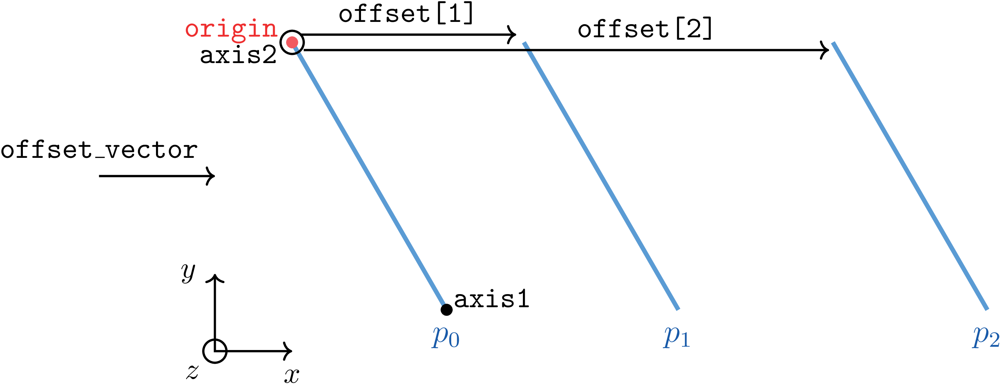

.. _inputs_sampling:

Section: Sampling
~~~~~~~~~~~~~~~~~

This section controls data-sampling actions supported within
AMR-Wind. The input parameters below use the label ``sampling`` as an example,
as if this was provided to :input_param:`incflo.post_processing` in the input file.
For more information on specifying
when sampled data is output to a file, see the :ref:`post-processing
inputs <inputs_post_processing>`

.. input_param:: sampling.output_format

   **type:** String, optional, default = "native"

   Specify the format of the data outputs. Currently the code supports the
   following formats

   ``native``
       AMReX particle binary format. This is the preferred output format for performance.

   ``ascii``
       AMReX particle ASCII format. Note, this can have significant impact
       on performance and must be used for debugging only.

   ``netcdf``
       This requires linking to the netcdf library. If netcdf is linked to AMR-Wind and output format
       is not specified then netcdf is chosen by default.

.. input_param:: sampling.labels

   **type:** List of one or more names

   Labels indicate the names of the different types of samplers (e.g., line,
   plane, probes) that are used to sample data from the flow field.

   For example, if the user uses

   Example::

      sampling.labels = line1 lidar1 plane1 probe1

   Then the code expects to read ``sampling.line1, sampling.plane1,
   sampling.probe1`` sections to determine the specific sampling probe information.

.. input_param:: sampling.fields

   **type:** List of one or more strings

   List of CFD simulation fields to sample and output

.. input_param:: sampling.int_fields

   **type:** List of one or more strings

   List of CFD simulation int fields to sample and output (e.g. mask_cell)

.. input_param:: sampling.derived_fields

   **type:** List of one or more strings

   List of CFD simulation derived fields to sample and output (e.g. mag_vorticity)

AMReX particle binary format
````````````````````````````

The native format can be read by ParaView or using Python scripts. We
provide an example in the source code and the :ref:`post processing
documentation <post_processing>`. A typical data frame might look
like:

.. code::

          uid  set_id  probe_id          xco     yco    zco  velocityx  velocityy  velocityz
     0      0       0         0   200.000000   200.0  200.0   6.129077   5.143022        0.0
     1      1       0         1   244.444444   200.0  200.0   6.129077   5.144596        0.0
    ..    ...     ...       ...          ...     ...    ...        ...        ...        ...
   595    595       1       195   555.555556  1000.0  999.0   6.128356   5.142301        0.0
   596    596       1       196   666.666667  1000.0  999.0   6.128356   5.142301        0.0

where ``uid`` is the global probe id, ``set_id`` is the label id
(e.g., ``plane_sampling.labels = plane1 plane2``, numbered as the user
input order), ``probe_id`` is the local probe id to this label,
``*co`` are the coordinates of the probe, and the other columns are
the user requested sampled fields. The same labels are seen by other
visualization tools such as ParaView. The directory also contains a
``sampling_info.yaml`` YAML file where additional information (e.g., time) is
stored. This file is automatically parsed by the provided particle
reader tool and the information is stored in a dictionary that is a
member variable of the class.

Sampling along a line
``````````````````````

The ``LineSampler`` allows the user to sample the flow-field along a line
defined by ``start`` and ``end`` coordinates with ``num_points`` equidistant
nodes.

Example::

  sampling.line1.type       = LineSampler
  sampling.line1.num_points = 21
  sampling.line1.start      = 250.0 250.0 10.0
  sampling.line1.end        = 250.0 250.0 210.0

Sampling along a line moving in time (virtual lidar)
``````````````````````````````````````````````````````

The ``LidarSampler`` allows the user to sample the flow-field along a line
defined by ``origin`` and spanning to ``length``
with ``num_points`` equidistant nodes.
Location of the line is given by the time histories
``azimuth_table`` and ``elevation_table``.
Angles are given in degrees with 0 azimuth and 0 elevation being the
x direction. Lidar measurements may also be collected at a constant location
by specifying only one entry to the tables.

Example::

  sampling.lidar1.type            = LidarSampler
  sampling.lidar1.num_points      = 21
  sampling.lidar1.origin          = 250.0 250.0 10.0
  sampling.lidar1.length          = 500.0
  sampling.lidar1.time_table      = 0 10.0
  sampling.lidar1.azimuth_table   = 0 90.0
  sampling.lidar1.elevation_table = 0 45.0

Sampling on one or more planes
```````````````````````````````

The ``PlaneSampler`` samples the flow-field on two-dimensional planes defined by
two axes: ``axis1`` and ``axis2`` with the bottom corner located at ``origin``
and is divided into equally spaced nodes defined by the two entries in
``num_points`` vector. Multiple planes parallel to the reference planes can be
sampled by specifying the ``offset_vector`` vector along which the planes are
offset for as many planes as there are entries in the ``offset`` array.

Example::

  sampling.plane1.type          = PlaneSampler
  sampling.plane1.axis1         = 1.0 0.0 0.0
  sampling.plane1.axis2         = 0.0 0.0 1.0
  sampling.plane1.origin        = 0.0 0.0 0.0
  sampling.plane1.num_points    = 10 10
  sampling.plane1.offset_vector = 1.0 0.0 0.0
  sampling.plane1.offsets       = 0.0 2.0 3.0

Illustration of this example:



   Example of sampling on planes.

Sampling at arbitrary locations
````````````````````````````````

The ``ProbeSampler`` allows the user to sample the flow field at arbitrary
locations read from a text file (default: ``probe_locations.txt``).

Example::

  sampling.probe1.type = ProbeSampler
  sampling.probe1.probe_location_file = "probe_locations.txt"

The first line of the file contains the total number of probes for this set.
This is followed by the coordinates (three real numbers), one line per probe.
This type of sampler also supports the ``offset_vector`` and ``offsets`` options
implemented with the plane sampler, shown above. For the probe sampler,
these options apply offsets to the positions of all the points provided in the
probe location file.

Sampling on a volume
`````````````````````

The ``VolumeSampler`` samples a 3D volume that starts at ``lo`` and
extends to ``hi``. The resolution in all directions is specified by
``num_points``.

Example::

  sampling.volume1.type        = VolumeSampler
  sampling.volume1.hi        = 3.0 1.0 0.5
  sampling.volume1.lo      = 0.0 0.0 -0.5
  sampling.volume1.num_points  = 30 10 10

Sampling on the air-water interface
```````````````````````````````````

The ``FreeSurfaceSampler`` samples on the air-water interface, and it requires the
vof (volume-of-fluid) field to be present in order to function. The sample locations
are specified using a grid that starts at ``plane_start`` and
extends to ``plane_end``. The resolution in each direction is specified by
``plane_num_points``. The coordinates of the sampling
locations are determined by the location of the air-water interface in the search
direction, specified by ``search_direction``, and the other coordinates are
determined by the ``plane_`` parameters. The default search direction parameter
is 2, indicating the samplers will search for the interface along the z-direction.
Due to this design, it is best to specify a plane that is normal to the intended
search direction.

Another optional parameter is ``num_instances``, which is available
for cases where the interface location is multi-valued along the search direction,
such as during wave breaking. This parameter defaults to 1, and the sampler will
automatically select the highest position along the search direction when the interface
location is multi-valued.

The free surface location is calculated with
a geometric approach using the reconstruction of the interface in a computational
cell. However, within the numerical beach of a wave simulation, the volume fraction distribution
can become noisy, and the geometric approach produce noisy results. To avoid this,
there is an option to use a linear interpolation approach instead within the beach,
which helps to reduce the noise. This can be turned on using the argument
``linear_interp_extent_from_xhi``, which specifies the extent from the upper domain boundary (in x)
where linear interpolation should be used instead of the standard geometric approach. This 
input parameter should be set to the length of the numerical beach.

Example::

  sampling.fs1.type             = FreeSurfaceSampler
  sampling.fs1.plane_start      = 4.0 -1.0 0.0
  sampling.fs1.plane_end        = 0.0 1.0  0.0
  sampling.fs1.plane_num_points = 20 10