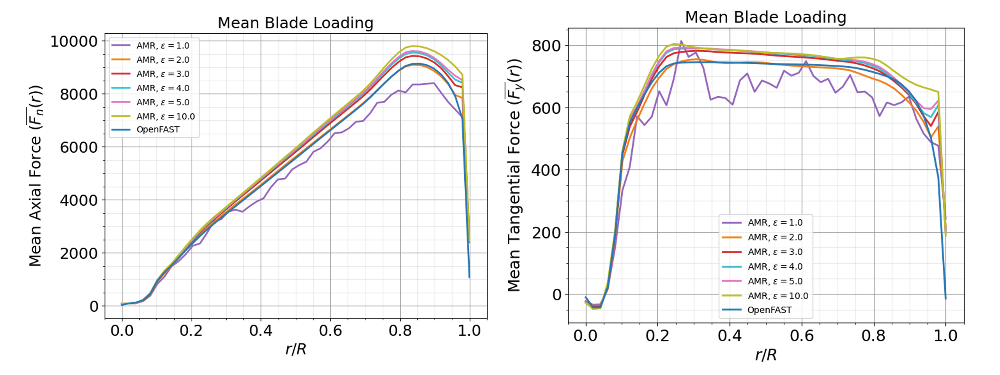

.. _calibration:

Actuator Line Model Calibration
===============================

This walkthrough provides an overview of important considerations for calibrating an Actuator Line Model (ALM) for wind turbine large eddy simulation (LES). The primary focus is on calibrating the :math:`\epsilon` parameter, which controls the spreading of turbine aerodynamic forces into body forces, effectively determining how these forces are distributed to the surrounding fluid. Also discussed are considerations regarding the simulation time step :math:`\Delta t`, the filtered lifting line correction (FLLC), the number of actuator node points, and the near-turbine resolution :math:`\Delta x`. The IEA-15MW-240 turbine model will be used here as an example [add link to turbine model?]

Calibrating Epsilon
--------------------

In this tutorial, we will focus on calibrating the epsilon parameter to align the ALM results with those obtained from a stand-alone OpenFAST simulation in uniform flow conditions. These ideal conditions are where OpenFAST turbine models are typically designed and trusted, so the OpenFAST turbine performance can be used to help tune the ALM model, despite generally being a lower fidelity model. An overview of the general process is provided below.

1. **Run OpenFAST Simulations**: Execute OpenFAST simulations under uniform flow conditions over a range of wind speeds to obtain baseline aerodynamic data.

2. **AMR-Wind Setup**: Construct a simple single-turbine mesh in AMR-Wind that can be used to efficiently run several uniform flow simulations over a range of :math:`\epsilon` parameters. Refinement zones can be useful for speeding up the calibration process, especially since there is no turbulence in the inflow. The important consideration is the near-turbine mesh size, since the :math:`\epsilon` parameter will be tuned according to this resolution. The near-turbine resolution may depend on computational cost or the desired fidelity. Here, an isotropic near-turbine resolution of :math:`\Delta x= 2.5m` is used, with four levels of refinment that range from a 20m background mesh to the 2.5m near-turbine mesh, as shown in the following figure:

.. image:: ./calibration_images/calibration_mesh.png
    :width: 100%

3. **Adjust Epsilon**: Run a series of AMR-Wind simulations over a range of epsilon values and wind speeds. Prior studies may be useful for choosing initial values. For instance, a general rule-of-thumb is that :math:`\epsilon / \Delta x \approx 2` seems to perform well for a variety of turbine models, however, this is not always true as seen for the IEA-15MW-240 model here. 
  To adjust epsilon, change the actuator epsilon parameter(s) in the AMR-Wind input file, such as:

.. code-block:: console

      Actuator.T0.epsilon                      = 5.0 5.0 5.0

Five different wind speeds WS = 5 m/s, 6.5 m/s, 9 m/s, 11 m/s, 14 m/s are included in the calibration here to cover region 1, 2, and 3 performance, and six different epsilon values are tested including :math:`\epsilon = 1, 2, 3, 4, 5, 10`. The initial calibrations are focused primarily at 9.0m/s, and the optimal epsilon value(s) are then tested at the other wind speeds. 

4. **Compare Results**: Run the ALM simulations and compare the results with those obtained from OpenFAST. Focus on key performance metrics. Below shows the results from OpenFAST and the AMR-Wind simulations at six different :math:`\epsilon` values for generated power, blade pitch, rotor speed, and rotor torque.

.. image:: ./calibration_images/ALM_Openfast_Comparison.png
    :width: 100%

The best agreement between the OpenFAST and ALM simulations is found for :math:`\epsilon = 2.0`, which leads to a 0.3% relative error in generated power at 9.0m/s. This value was also found to perform well at the other wind speeds. In addition to comparing turbine performance metrics, it is important to make sure the ALM has not introduced non-physical oscillations in the blade loading. The mean axial and tangential blade loading curves are shown below at 9.0m/s across the six different epsilon values. Again, the value of  :math:`\epsilon = 2.0` agrees well with the OpenFAST curve, and does not have significant osciallations along the blade span. 

5. **Iterate**: Repeat the process, adjusting epsilon as necessary until the ALM results align closely with the OpenFAST data.

Filtered Lifting Line Correction 
--------------------------------

An alternative to manually calibrating :math:`\epsilon` is to use the FLLC, as document in 
documented in `Martínez-Tossas et al. (JFM 2019) <https://www.cambridge.org/core/journals/journal-of-fluid-mechanics/article/filtered-lifting-line-theory-and-application-to-the-actuator-line-model/EA90C34B7D48030D725B3AFDC06501DF>`_ 
and 
`Martínez-Tossas et al. (JFM 2024) <https://onlinelibrary.wiley.com/doi/full/10.1002/we.2872>`_.

Timestep Considerations
-----------------------

The choice of timestep can significantly affect the accuracy and stability of your simulations. Here are some key points to consider:

Number of Actuator Node Points
-------------------------------

The number of actuator node points in the ALM influences the resolution of the aerodynamic model. Here are some guidelines:
