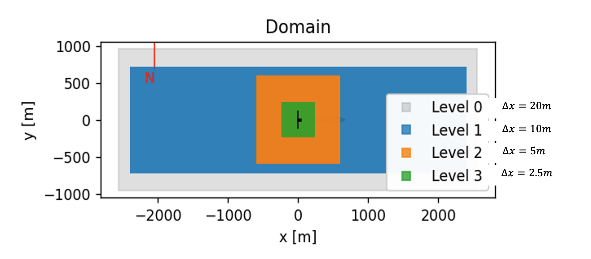
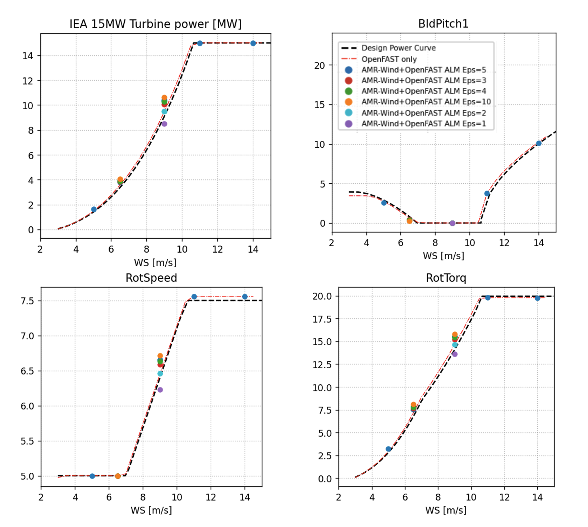
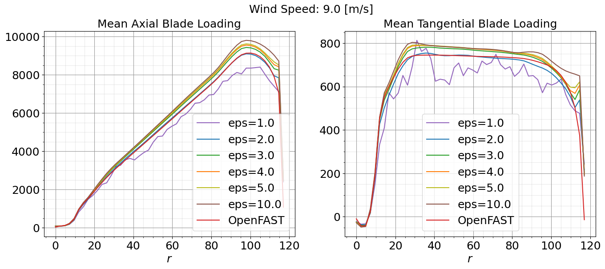
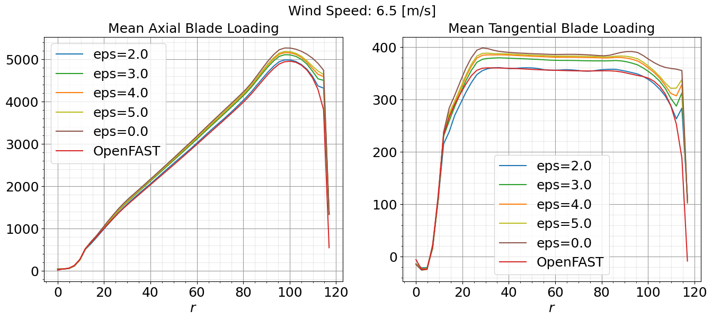
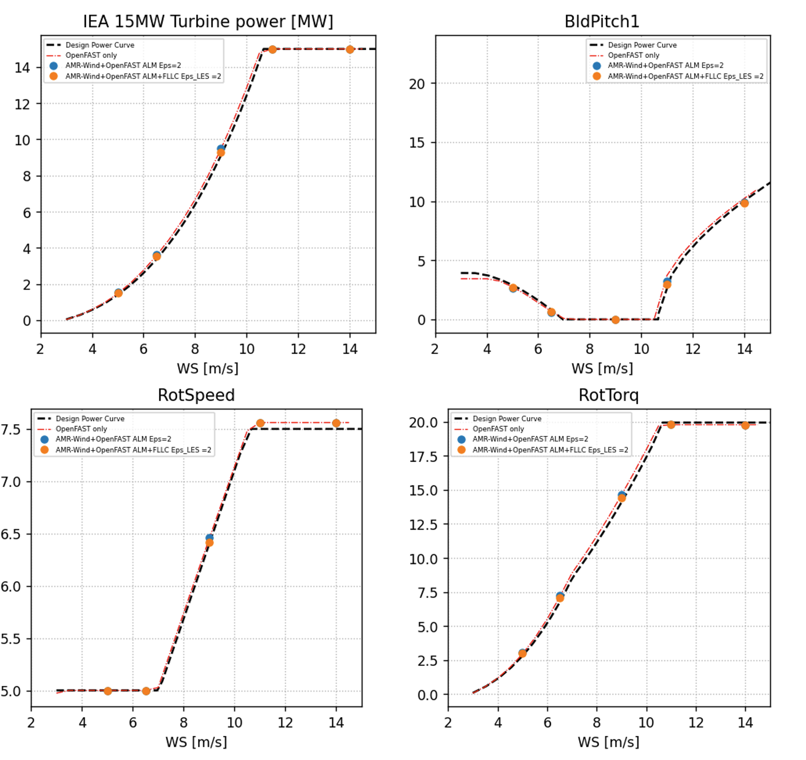
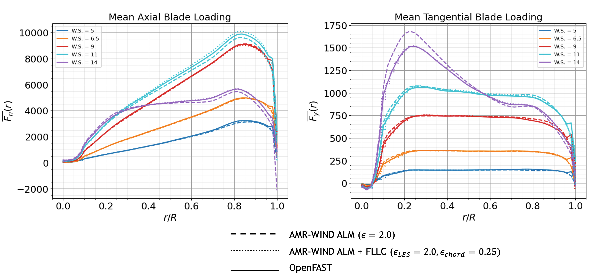

.. _calibration:

Actuator Line Model Calibration
===============================

This walkthrough provides an overview of important considerations for calibrating an Actuator Line Model (ALM) for wind turbine large eddy simulation (LES). The primary focus is on calibrating the :math:`\epsilon` parameter, which controls the spreading of turbine aerodynamic forces into body forces, effectively determining how these forces are distributed to the surrounding fluid. Also discussed are considerations regarding the simulation time step :math:`\Delta t`, the filtered lifting line correction (FLLC), the number of actuator node points, and the near-turbine resolution :math:`\Delta x`. The `IEA-15MW-240 <https://github.com/IEAWindTask37/IEA-15-240-RWT>`_ turbine model will be used here as an example.

.. _calibrating_epsilon:

Calibrating Epsilon
-------------------

In this tutorial, we will focus on calibrating the epsilon parameter to align the ALM results with those obtained from a stand-alone OpenFAST simulation in uniform flow conditions. These ideal conditions are where OpenFAST turbine models are typically designed and trusted, so the OpenFAST turbine performance can be used to help tune the ALM, despite generally being a lower fidelity model. An overview of the general process is provided below.

1. **Run OpenFAST Simulations**: Execute OpenFAST simulations under uniform flow conditions over a range of wind speeds to obtain baseline aerodynamic data.

2. **AMR-Wind Setup**: Construct a simple single-turbine mesh in AMR-Wind that can be used to efficiently run several uniform flow simulations over a range of :math:`\epsilon` parameters. Refinement zones can be useful for speeding up the calibration process, especially since there is no turbulence in the inflow. The important consideration is the near-turbine mesh size, since the :math:`\epsilon` parameter will be tuned according to this resolution. The near-turbine resolution may depend, for example, on computational cost, desired fidelity, or the spacing between actuator node points. Here, an isotropic near-turbine resolution of :math:`\Delta x= 2.5m` is used, with four levels of refinement that range from a 20m background mesh to the 2.5m near-turbine mesh, as shown in the following figure:

In this case, 50 actuator node points are used along the 120m blade, leading to a spacing of 2.4m or nearly :math:`\Delta x`. 

3. **Adjust Epsilon**: Run a series of AMR-Wind simulations over a range of epsilon values and wind speeds. Prior studies may be useful for choosing initial values. For instance, a general rule-of-thumb is that :math:`\epsilon / \Delta x \approx 2` seems to perform well for a variety of turbine models, however, this is not always true as seen for the IEA-15MW-240 model here. To adjust epsilon, change the actuator epsilon parameter(s) in the AMR-Wind input file:

.. code-block:: console

      Actuator.T0.epsilon                      = 5.0 5.0 5.0

For isotropic values of :math:`\epsilon`, a single number can be used: 

.. code-block:: console

      Actuator.T0.epsilon                      = 5.0

Five different wind speeds of 5 m/s, 6.5 m/s, 9 m/s, 11 m/s, and 14 m/s are included in the calibration here to cover regions 1, 2, and 3 performance, and six different epsilon values are tested including :math:`\epsilon = 1, 2, 3, 4, 5, 10`. The initial calibrations are focused primarily at 9.0m/s, and the optimal epsilon value(s) are then tested at the other wind speeds. 

4. **Compare Results**: Run the ALM simulations and compare the results with those obtained from OpenFAST. Focus on key performance metrics. The following figures show the results from OpenFAST and the AMR-Wind simulations at six different :math:`\epsilon` values for generated power, blade pitch, rotor speed, and rotor torque.

The best agreement between the OpenFAST and ALM simulations is found for :math:`\epsilon = 2.0`, which leads to a 0.3% relative error in generated power at 9.0m/s. This value was also found to perform well at the other wind speeds. 

In addition to comparing turbine performance metrics, it is important to make sure the ALM has not introduced non-physical oscillations in the blade loading. The mean axial and tangential blade loading curves are shown below at 9.0m/s and 6.5m/s across a range of different epsilon values. Again, the value of  :math:`\epsilon = 2.0` agrees well with the OpenFAST curve and does not have significant oscillations along the blade span. 

5. **Iterate**: Repeat the process, adjusting epsilon as necessary until the ALM results align closely with the OpenFAST data.
Based on the results shown here, :math:`\epsilon = 2.0` is the recommended setting for the IEA-15MW-240 turbine model at 2.5m resolutions or equivalently :math:`\epsilon / \Delta x = 0.8`. 

Filtered Lifting Line Correction 
--------------------------------

It has been shown that accurate predictions of the velocity field and loads along the blades are achieved with :math:`\epsilon^{opt} / c = 0.25` where :math:`c` is the chord length; however, this value of :math:`\epsilon` is typically much finer than can be resolved in a practical LES. To correct potential issues with the ALM for coarse-scale LES that cannot resolve this optimal kernel size, the filtered lifting line correction (FLLC) can be used, as documented in `Martínez-Tossas et al. (JFM 2019) <https://www.cambridge.org/core/journals/journal-of-fluid-mechanics/article/filtered-lifting-line-theory-and-application-to-the-actuator-line-model/EA90C34B7D48030D725B3AFDC06501DF>`_  and `Martínez-Tossas et al. (JFM 2024) <https://onlinelibrary.wiley.com/doi/full/10.1002/we.2872>`_. There are three steps to turning on FLLC for actuators in AMR-Wind. 

1. **Increase number of actuator points**: FLLC involves computing gradients along the blade, which typically requires a larger number of actuator points than an ALM without FLLC. Previous studies suggest :math:`\approx 300` AeroDyn blade points is appropriate for FLLC, which is the number used here. Therefore, the first step is to increase the number of AeroDyn blade points in the AeroDyn OpenFAST .dat file. This can be done, for example, through interpolation (see :ref:`additional_resources`). This number of actuator points must also be specified in the AMR-Wind input file:

.. code-block:: console

      Actuator.T0.num_points_blade            = 300

2. **Set epsilon_chord and epsilon_min**: In addition to epsilon, the epsilon_min and epsilon_chord parameters should be specified in the AMR-Wind input file: 

.. code-block:: console

   Actuator.T0.epsilon         = 2.0 2.0 2.0
   Actuator.T0.epsilon_min     = 2.0 2.0 2.0
   Actuator.T0.epsilon_chord   = 0.25 0.25 0.25

Here, epsilon and epsilon_min correspond to the value of :math:`\epsilon` for the ALM without FLLC (i.e., the value found in the previous section :ref:`calibrating_epsilon`). The parameter epsilon_chord corresponds to :math:`\epsilon^{opt} / c` and is typically set to 0.25, as mentioned above. 

3. **Turn on FLLC**: For each actuator to use FLLC, the fllc parameter must be set to true

.. code-block:: console

    Actuator.T0.fllc                         = true

As shown in the figures below, FLLC generally improves the representation of the blade loading and maintains the good agreement in turbine performance metrics with OpenFAST.

Note that raising the number of AeroDyn blade points may significantly increase computational cost. In the example here, there was a 1.8 times slowdown in the average solve time per timestep when using FLLC.

Timestep considerations
-----------------------

In addition to the CFL condition, there is a general rule-of-thumb that the timestep, :math:`\Delta t`, should be set such that the blade(tip) does not rotate more than a grid cell per time step. Below, we verify this criterion is satisfied for the timestep :math:`\Delta t=0.02` used here, based on the rotor speed output from OpenFAST.

The mean rotor speed is found to range from 30.0 deg/s to 45.4 deg/s as the wind speed ranged from 5m/s to 14m/s. This means that, based on the mean rotor speeds and AMR-Wind timestep, the blades rotate between 0.60 – 0.91 deg/timesteps on average. The circumference of the rotor disk is :math:`240\pi` and, on average, the blades rotate between 0.0016 – 0.0025 rotations/timestep. Therefore, the blades move between 1.25 − 1.90 m/timestep or between 0.5 − 0.76 :math:`\Delta x` m/timestep. This distance is indeed less than a grid cell per timestep. 

.. Number of actuator node points
.. -------------------------------
.. The number of actuator node points in the ALM influences the resolution of the aerodynamic model. Here are some guidelines:

Input File
----------

An example of the AMR-Wind input file used for the ALM calibration with :math:`\epsilon=2.0` at a wind speed of 9.0m/s is included below:

.. literalinclude:: ./calibrate_inp.txt
   :linenos:

.. _additional_resources: 

Additional Resources
--------------------

- A Jupyter notebook for comparing AMR-Wind ALM results to OpenFAST data for the purpose of calibrating :math:`\epsilon` can be found on GitHub: https://github.com/gyalla/ALM_Calibrations/blob/main/ALM_Calibration_Notebook.ipynb. This notebook was used to make the figures shown here.

- A python script for interpolating AeroDyn OpenFAST .dat files to an arbitrary number of blade points can be on GitHub: https://github.com/gyalla/ALM_Calibrations/blob/main/interpolate_aerodyn.py.
