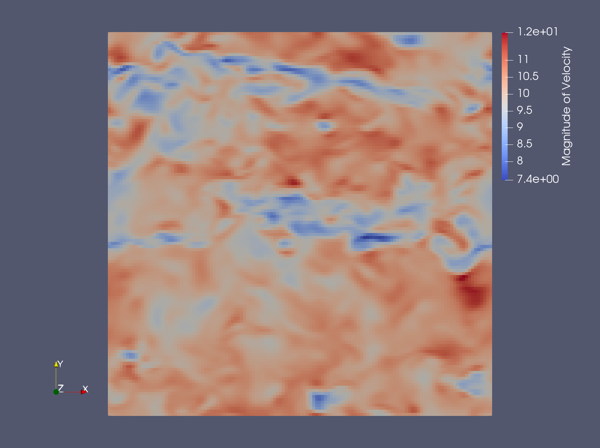

.. spelling:word-list::

   xy

.. _precursor:

Precursor (ABL) walkthrough
===========================

With AMR-Wind compiled, we can run simulations. In this section, we will run two simulations of a
weakly convective atmospheric boundary layer. The first simulation will be of a transient "spinup" phase,
and the second simulation will serve as a "precursor" for a turbine simulation.

Before simulating anything, we first need to set up the :doc:`input file <../user/inputs>`. This 
is a text file, and its filename traditionally ends with ``.inp``. There are generally two approaches to 
set one up: manually through a text editor, often beginning with an example file as a starting point,
or with the use of `amr-wind-frontend <https://github.com/Exawind/amr-wind-frontend>`_. For larger 
simulations, with many turbines and refinement zones, amr-wind-frontend is the ideal approach for 
input-file setup. This tool shows the locations of the turbines and refinements, providing a great 
sanity check for expensive simulations. For simpler simulations, with one or a handful of turbines,
the manual approach is typically sufficient when beginning from a valid starting point. If you do not 
have an input file on hand to use as a template, input files from the regression tests directory 
("test/test_files/") in the AMR-Wind repository can serve as examples. Please consult the 
:ref:`input file reference <input-file-ref>` to understand and appropriately modify the available input arguments.

Spinup simulation
-----------------
Here is the content of our spinup input file:

.. literalinclude:: ./spinup_inp.txt
   :linenos:

.. collapse:: Further details about some input arguments

   ABLForcing is the source term that pushes the flow field to a target
   velocity. That target velocity is specified by ``incflo.velocity``.
   The ABLForcing vector term is proportional to the difference between
   the target velocity and the xy-planar average velocity at the
   ``abl_forcing_height``. The ABLForcing term is applied uniformly to
   the entire domain and is intended to mimic the atmospheric pressure
   gradient in the context of a periodic domain.

   BoussinesqBuoyancy implements the effect of buoyancy based on
   differences between the local temperature and a reference temperature.
   CoriolisForcing represents the effect of the rotation of the earth
   on the flow field.

   Predominantly, the ``ABL`` arguments refer to details of the initial
   conditions, which also allow for perturbations designed to trip the onset
   of turbulence. However, the ``surface_`` details and the ``kappa``
   value inform the wall model at the lower boundary.

We are going to run the spinup simulation for a duration of two hours. The spinup simulation features a
fairly small domain with a coarse uniform grid resolution of 20 m and does not employ any grid refinement.

When running simulations on a cluster, please follow the etiquette expected on the machine, which is typically to use
a scratch directory as the active directory during a simulation run. In that context, you will also need a submission script.
Please consult the user manual of your cluster to design such a script properly. 

Here are a few tips for submitting an AMR-Wind run. If you used a Spack environment to compile
AMR-Wind, it is easiest to reference the amr-wind executable by activating Spack, activating the environment, and then using
the command ``spack load amr-wind`` to have the correct executable available without needing to specify its full path. Finally,
the syntax of the AMR-Wind command looks like

.. code-block:: console

    amr_wind spinup.inp

which should follow after an ``srun`` or ``mpiexec`` command (or similar) in a submission script to take advantage of parallelization.
This particular simulation has about 1 million cells, which means that it is suited run with about 50-80 CPU ranks.

If the simulation completes, the last time step reported will be 14400 at time 7200 s, and the job directory will contain
checkpoint (chk\*) and plotfile (plt\*) directories, along with a post_processing/ directory. Once the spinup simulation is done,
it is helpful to sanity check that the flow field variables make sense. The ``plt#####`` files can be opened using Paraview or other
visualization software that is AMReX-compatible. Another quick test is to plot the evolution of horizontally averaged vertical profiles,
which are provided through the ``abl_statistics`` file within post_processing/.

As an example, here we use Paraview and display the magnitude of the velocity at the final time of the simulation.

Precursor simulation
--------------------
After sufficiently spinning up turbulence, the "precursor simulation" follows. 
In the context of wind turbine LES, a precursor is a simulation that is run 
without a turbine for the explicit purpose of generating inflow boundary conditions. 
For computational efficiency, spinup and precursor simulations are almost always run
with periodic boundary conditions. This means wind that exits the outflow simulation
is then recirculated back into the inflow, which is a fine assumption for a statistically 
homogeneous atmosphere. However, this is problematic when wind turbines are 
present---turbines generate wakes, and these should not recirculate back to upstream
of the turbine. So we run wind turbine simulations with a prescribed "inflow boundary condition" 
(where the wind data comes from the precursor) and an "outflow boundary condition" (usually a pressure BC).

Here is the content of the precursor simulation.

.. literalinclude:: ./precursor_inp.txt
   :linenos:

This file is almost identical to the spinup input file, except there are a few differences:
    * This simulation starts from the last timestep of the spinup simulation, using the ``io.restart_file`` line
    * We are now saving boundary condition data, using the ``ABL.bndry*`` lines
    * Because the simulation after the precursor (inflow-outflow simulation with turbines) will have a much
      finer mesh, it will also require a smaller timestep, reduced by a factor of 4 to 0.125 seconds.
      Reducing the timestep in the precursor simulation as well (the ``time.fixed_dt`` line) permits the boundary
      plane and body force data to have better temporal resolution. This modification is not required for the 
      precursor, though; this workflow will still function fine with an unmodified precursor time step.
    * For more detailed analysis in post-processing, the frequency of ``sampling.output_frequency`` is increased.
      This argument actually refers to the output interval, so a smaller number means files are written more often.

|

Go to the next step: :doc:`turbine`
