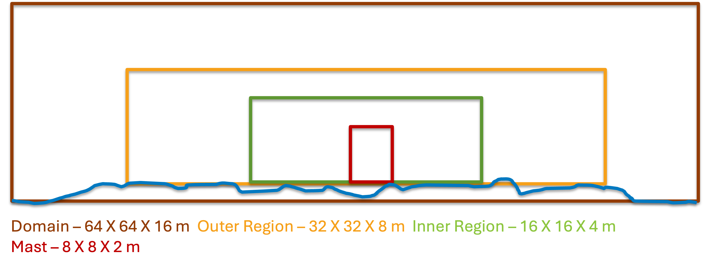

.. spelling:word-list::

   xy

.. _rans:

Wall-Modeled RANS 
============================
Most RANS simulations are run in steady or pseudo-steady mode. However, as AMR-Wind is a unsteady solver, 
we try to mimic pseudo-steady mode to ensure faster convergence of the simulations. The precursor input 
file for RANS is very similar to LES. The only modifications required are 

``turbulence.model  = KLAxell``

``TKE.source_terms = KransAxell``

However, a LES like setup takes a lot of time to convergence and is not required. It is recommended to use 
a more realistic vertical profile to start the RANS simulations to speed up convergence. 

``ABL.temperature_heights = 0  8.03137  16.0627  24.0941...``

``ABL.temperature_values = 300.001  300.001  300.001 ...``

There are also additional changes that can be made to speed-up the convergence. This is done by including the 
following variables in the input file: 

``ABL.initial_wind_profile                    = true``

``ABL.rans_1dprofile_file                     = "rans_1d.info"``

``ABL.meso_sponge_start                       = 650.0``

The first variable looks for a ``rans_1dprofile_file``. The file contains `z u v tke` (in that order, column format). The initial sounding can be 
provided from some external source. The profile is read  and used to create the initial profile for simulations. 
Changing the initial condition speeds up the convergence of the precursor simulation. The last term 
``meso_sponge_start`` is a forcing term to provide a speed-up of computation. The turbulent kinetic energy in the upper atmosphere 
is small and can oscillate before reaching a converged state. This term forces the convergence faster by removing the oscillation. 
The forcing is enabled only for the turbulent kinetic energy and temperature terms. The wind speed uses the Rayleigh damping. 

The RANS model can be used with terrain using the same method from LES with terrain by making the changes discussed above. 
It is recommended for terrain RANS simulations to setup the grid as follows: 

The above setup is experimental and may need fine tuning in the future. 