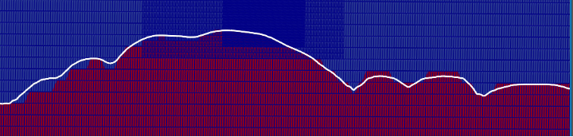

.. spelling:word-list::

   xy

.. _terrain:

LES with Terrain 
============================

In this walkthrough, we discuss the steps to setup a terrain simulation using the newly implemented 
immersed boundary forcing method (IBFM). The theory for the technique can be found at
`this link <https://agupubs.onlinelibrary.wiley.com/doi/full/10.1029/2020MS002141>`_.

The setup for the terrain follows the typical simulation of the atmospheric boundary layer (ABL) using 
large eddy simulation or Reynolds-averaged Navier Stokes turbulence models. The IBFM can be used with
periodic or inflow-outflow boundary conditions with few modifications. 

The first step in including the terrain is to set the terrain
variables. This is accomplished by modifying the ABL physics to
include the ``TerrainDrag`` flow physics: ``incflo.physics = ABL
TerrainDrag``.  This looks for the ``terrain.amrwind`` text file in
the case folder (this is the default name, the user can modify the
file it searches for by specifying the ``TerrainDrag.terrain_file``
input parameter). The file contains the terrain height as a single
column organized as: ``nx, ny, x values (of length nx), y values (of
length ny), terrain height values (of length nx x ny)``.

The second step is the inclusion of the terrain forcing in the momentum and energy equations. This is 
accomplished by adding ``DragForcing`` and ``DragTempForcing`` terms to ``ICNS.source_terms`` and 
``Temperature.source_terms``, respectively. The terrain simulations requires adding a sponge layer
at the outflow and Rayleigh damping at top of the domain. Rayleigh damping is already available from 
the existing forcing terms and can be used directly. The sponge-layer is implemented by specifying the boundary 
and the span. For example, a sponge layer of size 1000 m at the east (+x) boundary, 
we need to include ``DragForcing.sponge_east=1`` and ``DragForcing.sponge_distance_east=1000`` in the input file. 
The sponge layer is not required for periodic boundary boundary conditions. The only input recommended for the 
energy equation source term is the specification of the internal temperature of the terrain. This is 
set as ``transport.reference_temperature=300``. The current terrain setup can only 
be used for the simulation of neutral ABL. A future release will update this calculation to automatically use 
the values from a precursor simulation for both neutral and  non-neutral stratification. 
The terrain can be visualized by including ``io.int_outputs = terrain_blank`` in the input file. 

It is recommended to use the ``ProbeSampler`` to create the terrain-aligned output planes. The easiest method
to generate the text file for ``ProbeSampler`` is to write the STL as a text file and then use offsets in 
postprocessing to write the planes at different heights above the terrain. The terrain-aware output can 
also be used with FAST.Farm and FLORIS.

An example paraview visualization of the terrain is shown below (with three levels of refinement): 

Here is a sample content of precursor and inflow-outflow input files to drive terrain simulations: 

.. literalinclude:: ./terrain_precursor_inp.txt
   :linenos:

.. literalinclude:: ./terrain_inp.txt
   :linenos:

Setup using Python Tools
------------------------
The setup of the terrain files can be cumbersome to do by hand. A set of python tools are made available at 
`amrTerrain <https://github.com/hgopalan/amrTerrain/tree/main/src/backend>`_. A more comprehensive set of tools 
will be available in future at: `windtools <https://github.com/rthedin/windtools>`_.

The python code is executed as follows: 

.. code-block:: console

    python backendinterface.py nameofyamlfile.yaml 

Sample input files are available in the GitHub repository. A typical sample file looks as follows: 

.. literalinclude:: ./terrain_yaml.txt
   :linenos:

The variable ``caseType`` takes three kinds of inputs: ``precursor`` or ``terrain`` or ``terrainTurbine``. For
running terrain simulations, it is recommended to use ``caseType:terrain``. The use of ``caseType:terrainTurbine``
also creates turbines aligned with the terrain height using the turbine latitude and longitude in the file ``turbine.csv``. 

The python code first reads the ``centerLat`` and ``centerLon`` and creates a domain of size specified by 
``west``, ``east``, ``south``, and ``north``. For the example shown above, a domain size of 10 km is created
around ``centerLat`` and ``centerLon``. The terrain module uses the SRTM 30 m database to create the terrain. 
It is possible to add a user-defined file to define the terrain by modifying the python code. 

The ``cellSize: 128`` sets a grid resolution of 128 m at level 0.The variable ``verticalAR: 4``  sets ``dz=4dx=4dy``. 
You do not need ``Hypre`` to run the high aspect ratio simulations. User has to manually edit the 
input file to create refinement regions in area of interest around the terrain. 

All other inputs in the yaml file are for creating dummy inputs to the AMR-Wind simulations and user can 
modify them manually to fit their needs. The inputs ``caseType: "terrainTurbine"`` and ``turbineType: "UniformCtDisk"``
are useful for aligning the turbine vertically with the terrain. The file includes all the turbines within the continental 
US and have to be modified for other locations. The turbine type information is ad-hoc and has to be manually modified by 
the user for the specific turbine type. A future update to the code will include options to specify the turbine information 
from a text file. 

