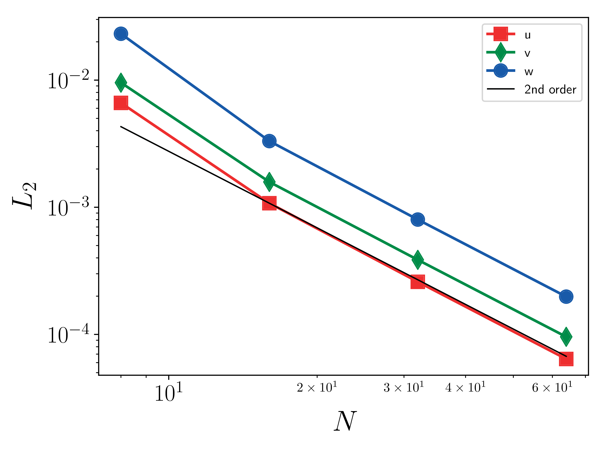

.. _dev-verification:

Verification
============

Verification of AMR-WIND uses `MASA <https://github.com/manufactured-solutions/MASA>`_ and auto-differention tools to implement the Method of Manufactured Solutions.

Building and linking MASA
~~~~~~~~~~~~~~~~~~~~~~~~~

The user must first build and install `MASA
<https://github.com/manufactured-solutions/MASA>`_. This can be done
from source or using `Spack <https://spack.io>`_.

Building MASA from source
#########################

The user must build both `Metaphysicl
<https://github.com/roystgnr/MetaPhysicL>`_ and MASA. After defining
``METAPHYSICL_ROOT_DIR`` and ``MASA_ROOT_DIR``:

.. code-block:: bash

   $ git clone https://github.com/roystgnr/MetaPhysicL
   $ ./bootstrap
   $ ./configure --prefix=$METAPHYSICL_ROOT_DIR
   $ make
   $ make install

.. code-block:: bash

   $ git clone https://github.com/manufactured-solutions/MASA
   $ ./bootstrap
   $ ./configure --enable-fortran-interfaces METAPHYSICL_DIR=$METAPHYSICL_ROOT_DIR --prefix=$MASA_ROOT_DIR --enable-python-interfaces
   $ make
   $ make check
   $ make install

Building MASA using Spack
#########################

Assuming the user has Spack configured for their system, building and
installing MASA is as easy as:

.. code-block:: bash

   $ spack install masa

Linking MASA to AMR-Wind
########################

The following CMake options enable MASA in AMR-Wind:

.. code-block:: bash

   -DAMR_WIND_ENABLE_VERIFICATION=ON -DAMR_WIND_ENABLE_MASA=ON -DMASA_DIR=$MASA_ROOT_DIR

where ``MASA_ROOT_DIR`` is the MASA install location.

Performing the MMS verification
~~~~~~~~~~~~~~~~~~~~~~~~~~~~~~~

For an MMS verification study, one performs a convergence study using
an MMS input file, several examples of which can be found in the
regression test suite. The velocity errors are computed after each
time step and logged to a text file named `mms.log`. The following
results for the Godunov FV method exhibit the expected second order
accuracy:

- Velocity (u, v, w) :math:`L_2` error norms:

The :math:`L_2` error norm for a quantity :math:`s` is defined as

.. math::
   e_s = \sqrt{ \frac{\sum_{i=1}^{N_e} \int_{V_i} (s^h-s^*)^2 \mathrm{d}V}{\sum_{i=1}^{N_e} \|V_i\|}}

where :math:`s^h` is the numerical solution, :math:`s^*` is the exact
solution, and :math:`N_e` is the number of elements. :math:`N`, used
below, is the number of element on a side of the cube (:math:`N_e =
N^3`).
