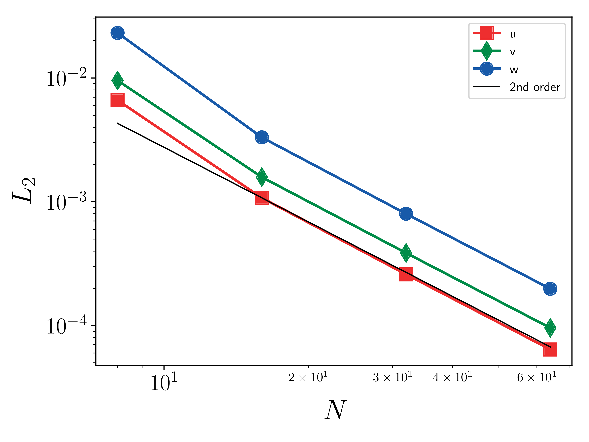

.. _dev-verification:

Verification
============

Verification of AMR-WIND uses `MASA
<https://github.com/manufactured-solutions/MASA>`_ and
auto-differention tools to implement the Method of Manufactured
Solutions. MMS verification has been performed for both CPU and GPU
architectures.

Building and linking MASA
~~~~~~~~~~~~~~~~~~~~~~~~~

The user must first build and install `MASA
<https://github.com/manufactured-solutions/MASA>`_. This can be done
from source or using `Spack <https://spack.io>`_.

Building MASA from source
#########################

The user must build both `Metaphysicl
<https://github.com/roystgnr/MetaPhysicL>`_ and MASA. After defining
``METAPHYSICL_ROOT_DIR`` and ``MASA_ROOT_DIR``:

.. code-block:: bash

   $ git clone https://github.com/roystgnr/MetaPhysicL
   $ ./bootstrap
   $ ./configure --prefix=$METAPHYSICL_ROOT_DIR
   $ make
   $ make install

.. code-block:: bash

   $ git clone https://github.com/manufactured-solutions/MASA
   $ ./bootstrap
   $ ./configure --enable-fortran-interfaces METAPHYSICL_DIR=$METAPHYSICL_ROOT_DIR --prefix=$MASA_ROOT_DIR --enable-python-interfaces
   $ make
   $ make check
   $ make install

Building MASA using Spack
#########################

Assuming the user has Spack configured for their system, building and
installing MASA is as easy as:

.. code-block:: bash

   $ spack install masa

Linking MASA to AMR-Wind
########################

The following CMake options enable MASA in AMR-Wind:

.. code-block:: bash

   -DAMR_WIND_ENABLE_MASA=ON -DMASA_DIR=$MASA_ROOT_DIR

where ``MASA_ROOT_DIR`` is the MASA install location.

Performing the MMS verification
~~~~~~~~~~~~~~~~~~~~~~~~~~~~~~~

For an MMS verification study, one performs a convergence study using
an MMS input file, several examples of which can be found in the
regression test suite. The velocity errors are computed after each
time step and logged to a text file named `mms.log`. The following
results for the Godunov FV method exhibit the expected second order
accuracy:

- Velocity (u, v, w) :math:`L_2` error norms:

The :math:`L_2` error norm for a quantity :math:`s` is defined as

.. math::
   e_s = \sqrt{ \frac{\sum_{i=1}^{N_e} \int_{V_i} (s^h-s^*)^2 \mathrm{d}V}{\sum_{i=1}^{N_e} \|V_i\|}}

where :math:`s^h` is the numerical solution, :math:`s^*` is the exact
solution, and :math:`N_e` is the number of elements. :math:`N`, used
below, is the number of element on a side of the cube (:math:`N_e =
N^3`).

Convecting Taylor Vortex (CTV)
~~~~~~~~~~~~~~~~~~~~~~~~~~~~~~

An exact solution to the incompressible Navier-Stokes equations is 
the Convecting Taylor Vortex (CTV) which can also be used to test the 
order of accuracy. This exact solution is two dimensional, viscous, unsteady 
and uses periodic boundary conditions. The exact solution is

.. math::
   u(x,y) = u_0 - \cos(\pi (x-u_0 t)) \sin(\pi(y-v_0 t)) e^{-2\omega t}
.. math::
   v(x,y) = v_0 - \sin(\pi (x-u_0 t)) \cos(\pi(y-v_0 t)) e^{-2\omega t}

where :math:`\omega = \pi^2 \nu` and :math:`\nu` is the viscosity. Simulating the CTV
to a fixed time of 0.2 seconds the :math:`L_2` error is measured over a set of grids with
varying mesh resolution. This is performed for two CFL numbers and shown in the figure: 

.. image:: ./ctv_error.png
   :width: 300pt
   
   
Ekman spiral 
~~~~~~~~~~~~

Solution method adapted from this Ekman `lecture 
<https://houraad.github.io/MPO503/Lecture%2011.xhtml>`_. Ekman assumed steady, homogeneous and horizontal flow with friction on a rotating Earth. Hence, the horizontal and time derivatives are zero.

.. math::
	\frac{\partial}{\partial t} = \frac{\partial}{\partial x} = \frac{\partial}{\partial y} = 0

This leave a balance between vertical friction and the Coriolis force:

.. math::
   -fv = A_z \frac{\partial^2 u}{\partial z^2}  (1)

.. math::
   fu = A_z \frac{\partial^2 v}{\partial z^2} + f u_g (2)

where :math:`A_z` is the eddy viscosity assumed to be constant throughout the boundary layer. If we multiply (2) by :math:`i` and add to (1) we get:

.. math::
   ifu - fv = \frac{\partial^2 \left( u + iv) \right)}{\partial z^2} 
   
where :math:`i = \sqrt{-1}`, rearranging the left hand side to get :math:`u+iv`

.. math::
   if(u+iv) = \frac{\partial^2 \left( u + iv) \right)}{\partial z^2} 
   
Next we define :math:`V = u+iv` and substitute that in:

.. math::
   \frac{\partial^2 V}{\partial z^2} - a^2 V = -a^2 u_g
   
where :math:`a = \sqrt{\frac{if}{A_z}}`. The solution to this constant coefficient second-order differential equation is:

.. math::
   V = Ae^{az} + Be^{-az} + u_g
   
The boundary conditions for this flow are :math:`z=0, u=v=0` and at :math:`z \rightarrow \infty, u \rightarrow u_g, v \rightarrow 0` therefore :math:`A=0`

.. math::
   V = B e^{-az} + u_g
   
where :math:`B = \hat{B}e^{i\phi}` and :math:`\phi` is the angle of the velocity to the wind. Now separating into real and imaginary parts:

.. math::
   a = \sqrt{\frac{if}{A_z}} = \sqrt{i} \sqrt{\frac{f}{A_z}} = \frac{1+i}{\sqrt{2}}  \sqrt{\frac{f}{A_z}}  = \left(1+i \right) \sqrt{\frac{f}{2 A_z}} = \frac{1+i}{D_E}
   
where :math:`D_E = \sqrt{\frac{2 A_z}{f}}` is the Ekman depth. 

.. math::
   V = \hat{B} e^{i\phi} e^{-(1+i)z/D_E} + u_g

rearranging

.. math::
   V = \hat{B} e^{-z/D_E} e^{i \left(\phi-z/D_E \right)} + u_g
   
using Eulers identity :math:`e^{i\theta} = \cos(\theta) + i \sin(\theta)` we can split this into real and imaginary parts

.. math::
   V = \hat{B} e^{-z/D_E} \left [ \cos(\phi-z/D_E ) + i \sin(\phi-z/D_E ) \right ] + u_g
   
.. math::
   u = \hat{B} e^{-z/D_E} \cos(\phi-z/D_E ) + u_g
   
.. math::
   v = \hat{B} e^{-z/D_E} \sin(\phi-z/D_E )
   
apply the boundary conditions :math:`u(0) = 0`,

.. math::
   \hat{B} + u_g = 0 \rightarrow \hat{B} = -u_g
 
simplifying further we arrive at the Ekman spiral solution
 
.. math::
   u = u_g\left [1- e^{-z/D_E} \cos(\phi-z/D_E ) \right]
   
.. math::
   v = u_g e^{-z/D_E} \sin(\phi-z/D_E )

Velocity profiles of AMR-wind with a Geostrophic wind of 15 m/s

.. image:: ./ekman_spiral_velocity.pdf
   :width: 300pt

Wind direction :math:`\tan^{-1}(v/u) \frac{180}{\pi}`

.. image:: ./ekman_spiral_wind_direction.pdf
   :width: 300pt
   
AMR-wind :math:`L_2` error after :math:`t=200` seconds. 

.. image:: ./ekman_spiral_error.pdf 
   :width: 300pt